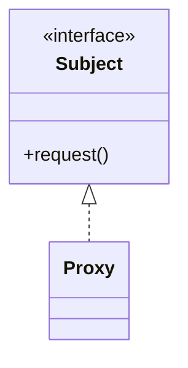

# Repository guide

Jekyll site on GitHub Pages (`remote_theme: mmistakes/minimal-mistakes`) holding a
design-patterns study series. Everything about ordering and navigation is derived
from front matter -- **there is no hand-maintained list of posts anywhere.**

## Adding a pattern post

Create one file:

```
_design_patterns/<module>-<pattern-slug>.md
```

The filename becomes the URL: `_design_patterns/m3-proxy.md` -> `/design_patterns/m3-proxy/`.
That is the only place the URL is defined; do not add a `permalink:`.

Then nothing else needs editing. Specifically, do **not** touch:

- `_data/navigation.yml` -- the sidebar is generated in `_includes/nav_list` by walking
  `site.design_patterns`, sorting on `order`, and grouping on `module`.
- the home page -- `_includes/learning_map.html` builds the map from the same collection.
- prev/next links -- `_includes/pattern_nav.html` derives them from `order`.

## Front matter schema

```yaml
---
title: "Proxy"                     # pattern name only, no "Design Patterns - " prefix
order: 12                          # position in the curriculum; drives sort, sidebar, prev/next
module: "M3"                       # module id
module_title: "Wrappers: The Four Siblings"
session: "6-7"                     # session number(s) from the curriculum
gof: "Structural"                  # Creational | Structural | Behavioral (omit for non-pattern posts)
kotlin: "replaced"                 # replaced | reshaped | intact  (omit for non-pattern posts)
kotlin_feature: "`by lazy` is a virtual proxy built into the language."
intent: "One sentence. Shown on the map and in the header box."
status: "outline"                  # outline | complete
excerpt_separator: "<!--more-->"
categories:
  - Design Patterns
tags:
  - Proxy
  - Structural
confused_with:                     # slugs of other posts; renders a cross-link block
  - m3-decorator
  - m3-adapter
redirect_from:                     # old URLs that used to serve this content
  - /design_patterns/proxy_pattern/
---
```

Notes:

- **`order` is the single source of truth for sequence.** Reordering within a module means
  editing `order` only -- no renaming, so URLs stay stable.
- Omit a key rather than setting it to `""`. Liquid treats the empty string as truthy, so an
  empty `gof:` renders an empty chip.
- `kotlin` drives the badge: `intact` is the one that gets the accent colour, because those
  are the patterns no Kotlin feature replaces.
- `confused_with` entries are **slugs** (the filename without `.md`), resolved at build time.
  A typo silently renders nothing -- run the check below.

## Body structure

The layout (`_layouts/pattern.html`) already renders the header box (module, session, GoF
category, Kotlin status, intent) and the footer (Telling It Apart + prev/next). The body
should start straight at the content:

1. One paragraph on why the pattern sits where it does in the curriculum
2. `## Structure` with a Mermaid diagram
3. Once written up in full, the session template: the problem without the pattern ->
   intent -> textbook Kotlin -> idiomatic Kotlin -> where it appears in real libraries ->
   consequences and when *not* to use it

## Diagrams

Mermaid, inline in the markdown. No build step, no PNG to regenerate.

````

````

The renderer is loaded in `_includes/head/custom.html`, which also unwraps the
`.language-mermaid` block that kramdown+rouge produces.

`assets/umls/*.puml` and `assets/images/umls/*.png` are the old PlantUML pipeline and are no
longer referenced by anything. Safe to delete.

## Local check

There is no CI. Before pushing, at minimum parse every front matter block and verify the
cross-links resolve:

```bash
python3 - <<'PY'
import glob, io, yaml, os
docs = {}
for f in glob.glob("_design_patterns/*.md"):
    fm = yaml.safe_load(io.open(f, encoding="utf-8").read().split("---")[1])
    docs[os.path.basename(f)[:-3]] = fm
orders = sorted(d["order"] for d in docs.values())
assert orders == list(range(1, len(orders) + 1)), "order must be 1..N with no gaps: %s" % orders
for slug, d in docs.items():
    for c in d.get("confused_with") or []:
        assert c in docs, "%s -> unknown slug %s" % (slug, c)
print("ok:", len(docs), "posts")
PY
```

## Things that will bite you

- `paginate` was removed from `_config.yml`. It was dead config (no `_posts`), and
  jekyll-paginate aborts the build when it is set with no `index.html` template present.
- `_pages/home.md` owns `permalink: /`. There must be no `index.html` at the repo root, and
  no post may claim `/` (an earlier version had Strategy sitting there).
- `_includes/nav_list` overrides a theme include. If minimal-mistakes changes that file
  upstream, re-diff it against
  <https://github.com/mmistakes/minimal-mistakes/blob/master/_includes/nav_list>.
- `_to_delete/` holds the previous version of the series, parked out of the build.
  Remove with `git rm -r _to_delete` once you are satisfied nothing is needed from it.
