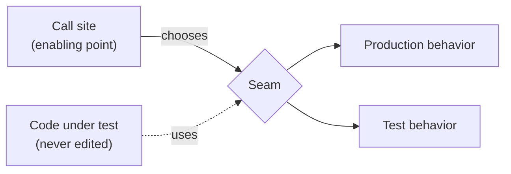

One definition carries the rest of the book, and it is not about design. It is about where you are allowed to intervene.

<!--more-->

## The definition

Feathers:

> A seam is a place where you can alter behavior in your program without editing in that place.

And immediately after it, the half that people drop:

> Every seam has an **enabling point**, a place where you can make the decision to use one behavior or another.

The second sentence is what makes the first operational. A dependency you *could in principle* replace is not a seam. A dependency you can replace **from somewhere else**, without opening the file you are afraid of, is.

So the working question for any dependency is exactly one sentence:

> **Where is the enabling point?**

If there is no answer, there is no seam, and that dependency is the reason the code cannot be tested.



## Why this framing and not "dependency injection"

Both end up in the same place a lot of the time, so it is worth being precise about the difference, because the difference is the reason the concept is useful on code you did not write.

**Dependency injection is a design instruction**: structure your code this way from the start.

**A seam is an observation**: this existing code already has, or can cheaply be given, a substitution point -- and here is where it is.

That reframing matters because legacy code was not designed your way and will not be redesigned before you have to change it. Seam-hunting is a survey of what you can exploit today. Most of the answer is DI-shaped, some of it is not, and the search is what is being taught.

## Feathers' three kinds, and what survives

The book lists three seam types, and the list is a product of its era -- it is a C++/Java book.

| Seam | Enabling point | In Kotlin |
|---|---|---|
| **Preprocessing** | `#define` before compilation | **None.** No preprocessor. Good. |
| **Link** | The linker / classpath | Weak. Roughly `expect`/`actual` and source-set substitution -- but the enabling point is *the build*, so it is coarse and slow |
| **Object** | The call site | **Everything.** This is the one to use |

The collapse to one category is not a loss. Preprocessing seams were always a hazard -- the enabling point was invisible from the code, so behavior depended on build flags nobody could see from the file. Link seams have the same problem with a longer feedback loop.

**The object seam's enabling point is a call site**, which means it is visible, greppable, and per-test. That is why the modern version of this technique set is smaller than the book and not worse.

## The Kotlin ladder

Ordered by cost, cheapest first. Take the first one that works.

**1. A default parameter with a function type.** The cheapest seam in the language, and the one most often skipped because people reach for an interface first.

```kotlin
class ScheduleStore(
    private val transport: Transport,
    private val now: () -> Long = { Clock.System.now().toEpochMilliseconds() },
)
```

No interface. No new file. **Zero production call sites change** -- and that last property is the whole test of a good seam.

**2. A constructor parameter with an interface**, when the collaborator has real behavior rather than one value. The standard object seam.

**3. `internal` plus the test source set.** Kotlin's test source sets see the module's `internal` declarations. This gives you a seam that is invisible to consumers of the module -- an enabling point that exists only for tests, without widening the public API.

**4. `expect`/`actual`.** Kotlin's link seam. Real, occasionally necessary for platform boundaries, and coarse: the enabling point is the build, so you cannot vary behavior per test. Keep the surface small.

**5. `open` and subclass-and-override.** Feathers' workhorse; in Kotlin it is last, because classes are `final` by default and making one `open` widens the contract permanently for a temporary testing need. **This gets its own module** -- the conflict between Kotlin's defaults and the book's default technique is the subject of M4.

## The trap: a seam that exists and is never used

Here is the finding that changed how I read the chapter.

Two classes in the same package, same layer, same author. Both take their server collaborator as a constructor parameter -- a textbook object seam, present and correct in both:

```kotlin
class SocialStore(private val transport: ServerTransport, /* ... */)
class SyncStore(private val transport: ServerTransport, /* ... */)
```

One of them has thirteen tests driven through that seam with a fake transport. The other, four times the size, has two.

**The seam is not the constraint.** It is there. It is identical. Something else is blocking the larger class, and the "something else" is the useful part:

- **Nine direct `Clock.System.now()` calls**, three of which stamp a timestamp into a request body that is then posted
- A **global `object`** for diagnostic logging, referenced directly
- A **global cache object**, referenced directly five times

None of these has an enabling point. A test can substitute the transport and still cannot assert on what gets posted, because the body contains a timestamp that changes every run.

```kotlin
suspend fun fileApplication(/* ... */): Boolean {
    val now = Clock.System.now().toEpochMilliseconds()   // no enabling point
    val req = Requests.application(/* ... */, now)
    transport.post("/requests", json.encodeToString(req)) ?: return false
    // ...
}
```

The fix is rung 1 of the ladder -- one default parameter, `now: () -> Long`, and `Clock.System.now()` becomes the default value instead of a hard call. Production is untouched. Tests pass `{ 1_000L }` and can finally assert on the posted body.

The general lesson is the one worth carrying:

> **A class is testable at the level of its *least* substitutable dependency.** One collaborator with no enabling point is enough to block a class that has three good seams.

Which means seam-hunting is not "find a seam." It is **enumerate every dependency and find the ones with no enabling point** -- because those, not the ones you already have, are the work.

## In the wild

Libraries that ship seams deliberately, because their authors expect to be tested against:

- **kotlinx-datetime** ships `Clock` as an interface with `Clock.System` as the default implementation. The entire reason is this problem. Taking a `Clock` rather than calling `Clock.System.now()` is rung 1 with a type instead of a lambda.
- **Ktor** ships `MockEngine` as an `HttpClientEngine`. The engine is a constructor parameter of `HttpClient` -- an object seam at the exact boundary where tests want one.
- **OkHttp's** `Interceptor` chain is a seam with the enabling point on the builder, which is why it is used for auth, retries, logging, and test stubbing without any of those living in the client.

The pattern across all three: **the seam sits at the process boundary** -- clock, network, filesystem -- and the enabling point is the constructor. If you are placing one seam in a class, that is where to place it.

## When to stop

**A seam with no second implementation and no test double is not a seam.** It is an interface you wrote for a future that has not arrived, and it costs a file and an indirection. This is the same gate as the [interface-count test]({{ "/changing_code/m0-measuring-change/" | relative_url }}): a substitution point nobody substitutes at is decoration.

**Do not add seams speculatively.** The justification for a seam is a test you are about to write. Not "this might need to be swappable." If you cannot name the test, do not add it.

**Do not make a class `open` to create a seam** until you have exhausted rungs 1--4. Widening inheritance is a permanent change to a public contract for a temporary need. M4 is entirely about what to do instead.

**Stop at the boundary of the change.** Seam-finding expands without limit -- every dependency has dependencies. The stopping rule is Feathers': you need enough seams to get *this* change under test, not enough to make the class ideal.

## Exercise

Take the class you would least like to modify. Do not refactor it. Make a table:

| Dependency | Enabling point |
|---|---|

One row per collaborator, including the invisible ones -- clocks, random, environment, global objects, direct constructor calls inside method bodies. For each, answer the question from the top of this post: **where would I decide, from outside this file, to use something else?**

The rows where the answer is blank are the reason the class has no tests. They are also, almost always, fewer than expected -- usually one or two, and usually a clock.

Next: **[characterization tests]({{ "/changing_code/m3-characterization-tests/" | relative_url }})** -- what to do once a seam exists, and why the first tests you write must not assert that the code is correct.
