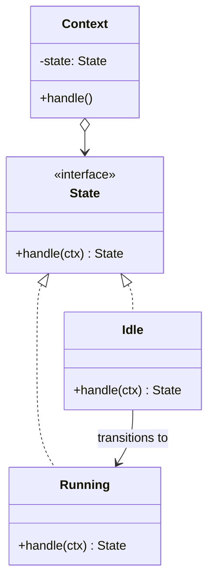

The same diagram as Strategy, with a different owner. The client never picks a state -- the states hand control to one another. The question to keep asking through this module is "who knows about the transition?" If the answer is the object itself, this is State.

<!--more-->

## The Problem

A shift-swap request that moves through an approval workflow:

```kotlin
enum class Status { DRAFT, SUBMITTED, PEER_APPROVED, APPROVED, REJECTED, CANCELLED }

class SwapRequest(
    var status: Status = DRAFT,
    var submittedAt: Instant? = null,
    var peerApprovedBy: User? = null,
    var rejectionReason: String? = null,
) {
    fun approve(by: User) {
        when (status) {
            DRAFT -> error("not submitted yet")
            SUBMITTED ->
                if (by.isPeer) { peerApprovedBy = by; status = PEER_APPROVED }
                else error("a peer must approve first")
            PEER_APPROVED ->
                if (by.isHeadNurse) status = APPROVED
                else error("already peer-approved")
            APPROVED -> error("already approved")
            REJECTED, CANCELLED -> error("closed")
        }
    }

    fun reject(by: User, reason: String) { when (status) { /* ...again... */ } }
    fun cancel(by: User)                 { when (status) { /* ...again... */ } }
}
```

Three problems, in increasing order of how much they will cost you.

**The same `when` appears in every method.** Adding a state means finding and editing all of them -- the fourth OCP smell from [Foundations]({{ "/design_patterns/m0-fundamentals/" | relative_url }}).

**There is nowhere you can read the state machine.** The legal transitions exist, but smeared across three methods. Ask "can a rejected request be cancelled?" and the only way to answer is to read all of them.

**Illegal states are representable.** Nothing stops `status = DRAFT` with `peerApprovedBy` set, or `REJECTED` with a null reason. Every method has to defend against combinations that should never have been constructible. This is the expensive one, because it never shows up as a compile error -- only as a bug report.

## Intent

> Allow an object to alter its behavior when its internal state changes. The object will appear to change its class.

Put plainly: **make each state a type, and let the state decide what happens next.**

## Structure



Compare that with the [Strategy]({{ "/design_patterns/m1-strategy/" | relative_url }}) diagram. The boxes are the same. The one new arrow -- `Idle --> Running` -- is the entire pattern: **concrete states know about each other, and concrete strategies never do.**

## Textbook Kotlin

```kotlin
interface SwapState {
    fun approve(ctx: SwapRequest, by: User)
    fun reject(ctx: SwapRequest, by: User, reason: String)
    fun cancel(ctx: SwapRequest, by: User)
}

object Submitted : SwapState {
    override fun approve(ctx: SwapRequest, by: User) {
        require(by.isPeer) { "a peer must approve first" }
        ctx.state = PeerApproved          // this state names the next one
    }
    override fun reject(ctx: SwapRequest, by: User, reason: String) {
        ctx.state = Rejected(reason)
    }
    override fun cancel(ctx: SwapRequest, by: User) { ctx.state = Cancelled }
}

class SwapRequest(internal var state: SwapState = Draft) {
    fun approve(by: User) = state.approve(this, by)
    fun reject(by: User, reason: String) = state.reject(this, by, reason)
    fun cancel(by: User) = state.cancel(this, by)
}
```

`SwapRequest` has no `when` left in it at all -- it forwards. Each state answers only for itself, and an operation that is illegal in a state is simply not implemented there.

Note the line `ctx.state = PeerApproved`. **That is the coupling Strategy does not have**, and it is where the design decision of this pattern lives -- see below.

## Idiomatic Kotlin

A sealed hierarchy lets each state carry exactly the data that is valid *in that state*, which kills the third problem outright:

```kotlin
sealed interface SwapState {
    data object Draft : SwapState
    data class Submitted(val at: Instant) : SwapState
    data class PeerApproved(val at: Instant, val peer: User) : SwapState
    data class Approved(val by: User, val at: Instant) : SwapState
    data class Rejected(val by: User, val reason: String) : SwapState
    data object Cancelled : SwapState
}
```

`Rejected` cannot exist without a reason. `PeerApproved` cannot exist without a peer. `Draft` has no room for an approver. **The nullable-field defence disappears because the illegal combinations can no longer be constructed.**

Transitions then become one total function:

```kotlin
sealed interface SwapEvent {
    data class Submit(val at: Instant) : SwapEvent
    data class Approve(val by: User, val at: Instant) : SwapEvent
    data class Reject(val by: User, val reason: String) : SwapEvent
    data object Cancel : SwapEvent
}

fun SwapState.on(event: SwapEvent): SwapState = when (this) {
    is Draft -> when (event) {
        is Submit -> Submitted(event.at)
        is Cancel -> Cancelled
        else -> this
    }
    is Submitted -> when (event) {
        is Approve -> if (event.by.isPeer) PeerApproved(at, event.by) else this
        is Reject  -> Rejected(event.by, event.reason)
        is Cancel  -> Cancelled
        else -> this
    }
    is PeerApproved -> when (event) {
        is Approve -> if (event.by.isHeadNurse) Approved(event.by, event.at) else this
        is Reject  -> Rejected(event.by, event.reason)
        else -> this
    }
    is Approved, is Rejected, is Cancelled -> this
}
```

Now the whole machine is readable in one screen, and `else -> this` is an explicit, auditable statement that the event is a no-op rather than an accident.

## Where the transition knowledge lives

This is the real design decision, and both answers are defensible.

**Decentralized (GoF classic).** Each state names its successors. Adding a state means editing the states adjacent to it, and no single file shows the whole machine. It pays off when each state carries a lot of behavior -- five methods each -- because then the states are substantial classes that deserve to own their own rules.

**Centralized (the `when` reducer above).** One function holds every transition. Adding a state means the compiler walks you through every branch that must handle it. You can read the machine, diff it, and test it as a pure function. It pays off when the per-state behavior is small, which in application code it usually is.

The `else -> this` branches are the cost of the centralized form: they make the `when` non-exhaustive on events, so a *new event* will not produce a compile error. If that matters, drop the `else` and spell out every event per state -- verbose, and completely safe.

> **A warning about a common lookalike.** `sealed class UiState { Loading; Success; Error }` in an MVI or Redux-style architecture is usually **not** this pattern. That is state-as-data with an external reducer, and the states have no behavior at all. It becomes State only when the state objects decide what happens next. The distinction matters because the two have different failure modes: state-as-data grows a fat reducer, State grows coupled state classes.

## In the Wild

- **`kotlinx.coroutines` `Job`** -- New, Active, Completing, Cancelling, Cancelled, Completed, with legal transitions enforced internally. The canonical modern example.
- **`WorkManager`'s `WorkInfo.State`** -- ENQUEUED, RUNNING, SUCCEEDED, FAILED, BLOCKED, CANCELLED, with terminal states that reject further transitions.
- **TCP connection states** -- the textbook example, and still the clearest one.
- **Android `Lifecycle.State`** -- an enum with an ordered comparison rather than behavior-bearing objects, which makes it the *state-as-data* variant, not GoF State.

## Consequences

**You get:** the repeated `when` gone from every method, transitions expressed as types the compiler checks, illegal states made unconstructible, and each state testable on its own.

**You pay:** more types, and -- in the decentralized form -- a machine you cannot read in one place.

**The trap: carrying common data across states.** Look again at `PeerApproved(val at: Instant, val peer: User)`. The `at` is the submission time, threaded through from `Submitted` and copied at every transition. Two states later you are copying four fields, and one of the copies will eventually be wrong.

The fix is to split invariant data from state-specific data:

```kotlin
data class SwapRequest(
    val id: SwapId,
    val requester: User,
    val target: Shift,
    val submittedAt: Instant?,   // belongs to the request, not to a state
    val state: SwapState,
)
```

The context holds what is true regardless of state; each state holds only what is true *because* of that state. If a field appears in three state classes, it belongs in the context.

**Don't use it when:**

- There are two or three states and exactly one method behaves differently. One `when` is clearer than four types.
- The transitions are chosen from outside. If a caller sets the next state directly, you have [Strategy]({{ "/design_patterns/m1-strategy/" | relative_url }}) with a misleading name.
- The states differ only in data, not in behavior, and a reducer already owns the rules. That is state-as-data; leave it alone.

## Module M1 in one table

| | Strategy | Template Method | State |
|---|---|---|---|
| What varies | The whole algorithm | Named steps in a fixed order | Behavior per state |
| Who chooses | The client, by injection | The subclass, at compile time | The object, at runtime |
| Do the variants know each other? | No | No | **Yes** -- that is the tell |
| Kotlin form | Function type | Higher-order function | `sealed interface` + transition |

If you can only keep one sentence from this module: **when the diagram cannot tell you which pattern you are looking at, ask who knows about the transition.**

## Exercise

Take a class in your code with a `status` field plus two or more nullable fields that are only meaningful in some statuses. Convert it to a sealed hierarchy where each state holds only its own data.

Then count the null checks you deleted. That number is how much the old design was costing you -- and it is the most direct evidence you will get that "make illegal states unrepresentable" is worth the extra types.
