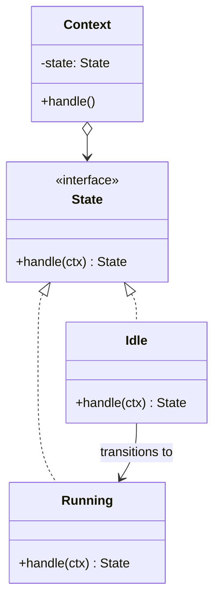

The same diagram as Strategy, with a different owner. The client never picks a state -- the states hand control to one another. The question to keep asking through this module is \"who knows about the transition?\" If the answer is the object itself, this is State.

<!--more-->

## Structure

