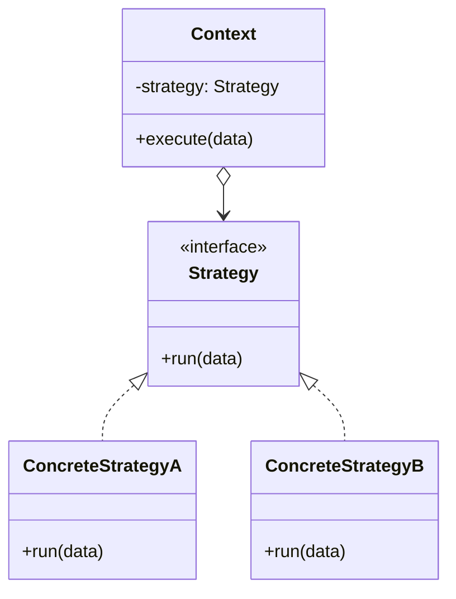

The first pattern in the curriculum, and the reference point for the next two. Strategy, Template Method and State draw almost the same class diagram; what separates them is who decides. Here the client picks the algorithm and hands it in. Hold onto that fact -- it is the entire difference from State.

<!--more-->

## Structure

