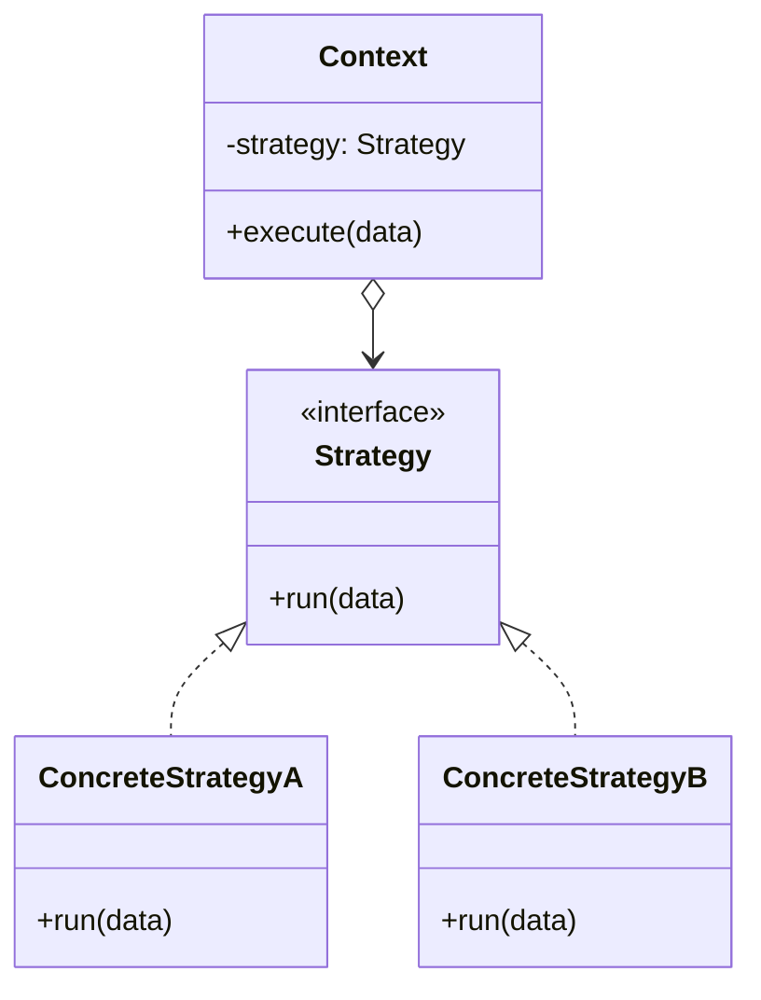

The first pattern in the curriculum, and the reference point for the next two. Strategy, Template Method and State draw almost the same class diagram; what separates them is who decides. Here the client picks the algorithm and hands it in. Hold onto that fact -- it is the entire difference from State.

<!--more-->

## The Problem

A shift scheduler that has to satisfy different constraints depending on the hospital:

```kotlin
class ShiftAssigner(private val hospital: Hospital) {

    fun assign(nurses: List<Nurse>, month: Month): Schedule {
        val model = CpModel()
        addCoverageConstraints(model, nurses, month)

        when (hospital.type) {                                   // (1)
            GENERAL -> addMaxThreeNightsInARow(model, nurses)
            ICU     -> { addMaxTwoNightsInARow(model, nurses)
                         addSeniorPairing(model, nurses) }
            CLINIC  -> addWeekendOff(model, nurses)
        }

        val objective = when (hospital.type) {                   // (2)
            GENERAL -> minimizeNightShiftSpread(model)
            ICU     -> minimizeSeniorityGap(model)
            CLINIC  -> minimizeWeekendWork(model)
        }

        return solve(model, objective)
    }

    fun explain(schedule: Schedule): String = when (hospital.type) { ... }   // (3)
}
```

A fourth hospital type means editing three separate `when` blocks and hoping you found them all. The compiler helps only if `HospitalType` is an enum *and* every branch is exhaustive -- one `else` anywhere and it stops helping entirely.

This is the OCP violation from [Foundations]({{ "/design_patterns/m0-fundamentals/" | relative_url }}) in its most common shape: **the same discriminator branched on in more than one place.**

## Intent

> Define a family of algorithms, encapsulate each one, and make them interchangeable. Strategy lets the algorithm vary independently from the clients that use it.

Put plainly: **pull the varying algorithm into its own object, and let the caller decide which one goes in.**

## Structure



## Textbook Kotlin

```kotlin
interface SchedulingPolicy {
    fun addConstraints(model: CpModel, nurses: List<Nurse>)
    fun objective(model: CpModel): LinearExpr
    fun explain(schedule: Schedule): String
}

class GeneralWardPolicy : SchedulingPolicy { /* ... */ }
class IcuPolicy : SchedulingPolicy { /* ... */ }
class ClinicPolicy : SchedulingPolicy { /* ... */ }

class ShiftAssigner(private val policy: SchedulingPolicy) {

    fun assign(nurses: List<Nurse>, month: Month): Schedule {
        val model = CpModel()
        addCoverageConstraints(model, nurses, month)
        policy.addConstraints(model, nurses)
        return solve(model, policy.objective(model))
    }
}
```

Three scattered `when` blocks collapse into one interface with three methods, and a fourth hospital type becomes a new file rather than an edit.

Notice what moved. `ShiftAssigner` no longer knows that `HospitalType` exists. **The knowledge of which policy applies now belongs to whoever constructs the assigner** -- and that relocation is the defining property of Strategy.

## Idiomatic Kotlin

When the strategy is a single stateless operation, the interface is ceremony. A function type says the same thing:

```kotlin
class NurseRanker(private val compare: Comparator<Nurse>)

NurseRanker(compareBy { it.seniority })
NurseRanker { a, b -> b.nightCount - a.nightCount }
```

`sortedWith`, `filter`, `maxByOrNull`, `fold` -- the standard library is Strategy all the way down, expressed as function types. Nobody calls it a pattern any more, which is the clearest sign a language absorbed one.

**Three signals that you should go back to the interface:**

1. **More than one operation.** The policy above has three. A triple of lambda parameters is strictly worse than an interface.
2. **The strategy has state** -- a rate limiter that counts, a policy that caches a solved sub-problem.
3. **You need to name, compare, serialize, or log it.** `(Money) -> Money` prints as `Function1`; `PercentageDiscount(0.1)` prints as itself.

A default argument covers the common case without a factory:

```kotlin
class ShiftAssigner(
    private val policy: SchedulingPolicy = GeneralWardPolicy(),
)
```

## In the Wild

- **`RecyclerView.LayoutManager`** -- `RecyclerView` has no idea what a grid is. The layout algorithm is injected.
- **OkHttp's `Dns`, `Authenticator`, `CookieJar`** -- each a strategy interface with a default, swapped through `OkHttpClient.Builder`.
- **`CoroutineDispatcher`** -- the dispatching algorithm, passed into the builder.
- **`Comparator`** -- the pattern absorbed so completely it lost its name.

Three of those four arrive as constructor or builder parameters. **Strategy usually shows up as a dependency, not as a class you go looking for.**

## Consequences

**You get:** the branching gone, runtime substitution, algorithms testable in isolation, and OCP along that one axis.

**You pay:** more types, and a client that now has to know which strategy to pick. Strategy does not remove that decision -- it *relocates* it. Usually it lands in a factory or a DI module, which is the right place, but it is not free.

**The trap that actually bites: the parameters of the strategy interface.** If you pass the union of everything any strategy might need, the interface grows and some implementations ignore half their arguments. An implementation that ignores its parameters is telling you the interface is wrong. Either pass the context object and accept the coupling, or model a smaller value type that captures exactly what strategies operate on.

**Don't use it when:**

- There are two branches and a third has never been requested -- gate 1 from Foundations
- The "algorithms" differ only by a constant. Pass the constant.
- The strategy needs to read *and write* the context's private state. You are describing [State]({{ "/design_patterns/m1-state/" | relative_url }}), or the split is in the wrong place.

## Exercise

Take one `when` in your own code that branches on a type or kind in more than one place. Extract it to a strategy interface, then ask the two questions that decide whether you should keep the refactoring:

1. Did the number of places that must change when a new kind appears go from N to 1?
2. Is the code now easier to follow, or did you just move the `when` into a factory and add three files?

If the answer to (2) is "moved it", that is still a win *when N was large* -- the factory is one place instead of three. If N was two, revert it.
