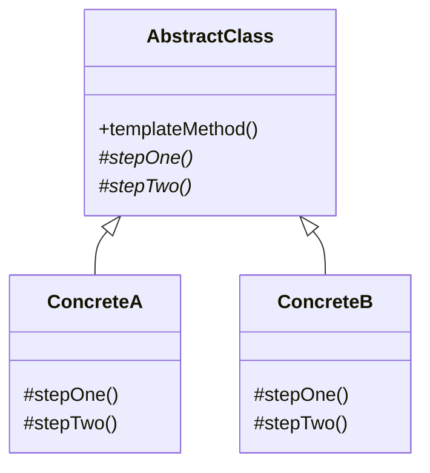

Strategy's inheritance twin. The skeleton lives in the base class and the varying steps are pushed down to subclasses, which fixes the choice at compile time instead of injecting it at runtime. Read it directly after Strategy and the trade-off between composition and inheritance stops being abstract.

<!--more-->

## Structure

