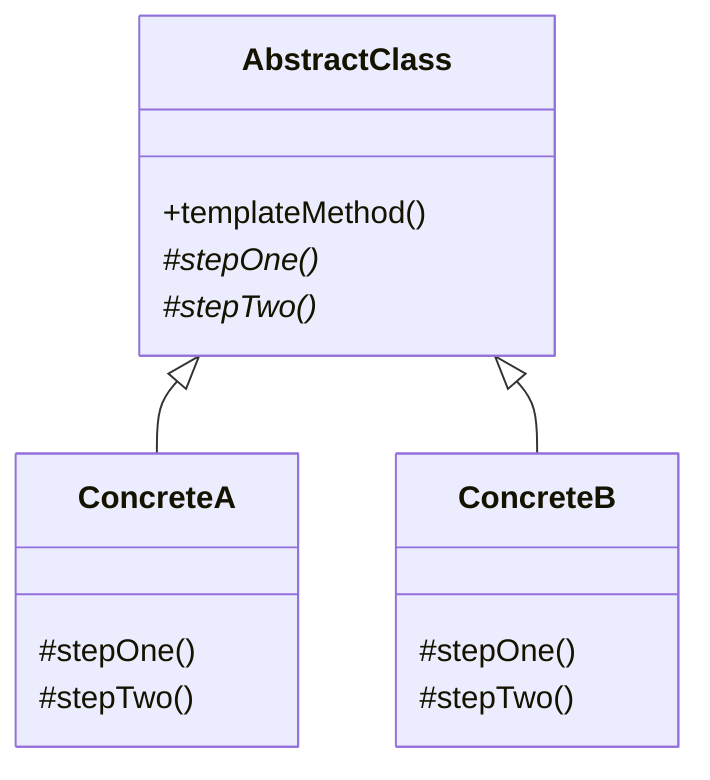

Strategy's inheritance twin. The skeleton lives in the base class and the varying steps are pushed down to subclasses, which fixes the choice at compile time instead of injecting it at runtime. Read it directly after Strategy and the trade-off between composition and inheritance stops being abstract.

<!--more-->

## The Problem

Three importers that do the same five things in the same order:

```kotlin
class CsvNurseImporter(private val repository: NurseRepository) {
    fun import(file: File): ImportResult {
        val rows = parseCsv(file.readText())                          // differs
        val nurses = rows.map { it.toNurseFromCsv() }                 // differs
        val valid = nurses.filter { it.isValid() }                    // identical
        repository.saveAll(valid)                                     // identical
        return ImportResult(valid.size, nurses.size - valid.size)     // identical
    }
}

class ExcelNurseImporter(private val repository: NurseRepository) {
    fun import(file: File): ImportResult {
        val rows = parseXlsx(file.readBytes())                        // differs
        val nurses = rows.map { it.toNurseFromXlsx() }                // differs
        val valid = nurses.filter { it.isValid() }                    // identical
        repository.saveAll(valid)                                     // identical
        return ImportResult(valid.size, nurses.size - valid.size)     // identical
    }
}
```

Two of five steps differ; the rest is copy-paste. When the result accounting changes it has to change in three files -- and one day it will change in only two of them.

## Intent

> Define the skeleton of an algorithm in an operation, deferring some steps to subclasses. Template Method lets subclasses redefine certain steps of an algorithm without changing the algorithm's structure.

Put plainly: **the order is fixed in one place; only the steps vary.**

## Structure



## Textbook Kotlin

```kotlin
abstract class NurseImporter(private val repository: NurseRepository) {

    fun import(file: File): ImportResult {          // note: not open
        val rows = readRows(file)
        val nurses = rows.map { toNurse(it) }
        val valid = nurses.filter { it.isValid() }
        repository.saveAll(valid)
        return ImportResult(valid.size, nurses.size - valid.size)
    }

    protected abstract fun readRows(file: File): List<Row>
    protected abstract fun toNurse(row: Row): Nurse
}

class CsvNurseImporter(repo: NurseRepository) : NurseImporter(repo) {
    override fun readRows(file: File) = parseCsv(file.readText())
    override fun toNurse(row: Row) = row.toNurseFromCsv()
}
```

Two things are worth pausing on.

**`import` is not `open`.** In Kotlin that is simply the default, and here the default is exactly right: the template method is the part that must not vary. In Java you would have to remember to write `final`. This is the language encoding *"design for inheritance or prohibit it"* -- and it is why Kotlin's `final`-by-default is a Template Method safety feature, not just a performance one.

**Control is inverted.** The subclass never calls the parent's algorithm; the parent calls down into the subclass. GoF names this the Hollywood Principle: *don't call us, we'll call you.* If you find a subclass calling `super.import()` and then doing more work, you are not using this pattern.

## Idiomatic Kotlin

Two varying steps do not justify a class hierarchy. A higher-order function expresses the same skeleton:

```kotlin
class NurseImporter(private val repository: NurseRepository) {

    fun import(
        file: File,
        readRows: (File) -> List<Row>,
        toNurse: (Row) -> Nurse,
    ): ImportResult {
        val nurses = readRows(file).map(toNurse)
        val valid = nurses.filter { it.isValid() }
        repository.saveAll(valid)
        return ImportResult(valid.size, nurses.size - valid.size)
    }
}
```

Look at what just happened: **that is Strategy.** The varying steps became injected values instead of overridden methods, and the inheritance disappeared. In Kotlin the two patterns converge whenever the varying parts are few and independent -- which is most of the time.

The most common shape in real code is a single-hook template wrapped around a resource or a transaction:

```kotlin
inline fun <T> Database.transaction(block: (Transaction) -> T): T {
    val tx = begin()
    try {
        val result = block(tx)
        tx.commit()
        return result
    } catch (e: Throwable) {
        tx.rollback()
        throw e
    }
}
```

Fixed skeleton, one variable step, no inheritance anywhere. `Closeable.use`, `runCatching`, `measureTimeMillis` and `withContext` are all this shape.

**When the class hierarchy still wins:**

1. **Three or more hooks, especially sharing state.** Five lambda parameters is worse than five overrides.
2. **Optional hooks with sensible defaults.** An `open fun onBeforeSave() {}` that most subclasses ignore is clumsy as a nullable lambda.
3. **The subclasses are a real domain concept** you want to name, inject and test on their own.

## In the Wild

- **`Closeable.use`, `runCatching`, `measureTimeMillis`** -- Template Method as a higher-order function.
- **Android `Activity` / `Fragment` lifecycle** -- the framework owns the sequence; you fill in `onCreate`, `onStart`, `onDestroy`. Pure Hollywood Principle, and the reason "just call `onCreate` yourself" never works.
- **Spring `JdbcTemplate`** -- named after the pattern. It owns the connection, the statement, exception translation and cleanup; you supply the row mapping.
- **JUnit `@BeforeEach` / `@AfterEach`** -- the runner owns the order, you own the steps.

## Consequences

**You get:** the duplicated skeleton written once, a compiler-enforced contract for the varying steps, and a single place to change the order.

**You pay:** inheritance. One superclass per subclass, fixed at compile time, and the fragile base class problem in full -- a change to the template can break subclasses that quietly relied on incidental ordering.

**The trap: hook creep.** Every new requirement adds another `protected open fun`. Most subclasses override none of them. The base class turns into a configuration surface nobody understands, and its `open` methods become an accidental public API. When you reach four or five hooks, the honest move is to convert them into strategy objects.

**Don't use it when:**

- The varying steps are one or two independent functions -- use a higher-order function
- Subclasses need to change the *order*, not just the steps. That is a different problem and this pattern will fight you.
- You want to swap behavior at runtime. Inheritance fixes it at construction.

## Strategy or Template Method?

|  | Strategy | Template Method |
|---|---|---|
| Mechanism | Composition | Inheritance |
| Bound | Runtime | Compile time |
| Direction of calls | Context calls the strategy | Base class calls down into the subclass |
| What varies | The whole algorithm | Named steps inside a fixed order |
| Cost of a new variant | A new object | A new subclass |
| Multiple variations at once | Compose several strategies | One superclass, so no |

In Kotlin they collapse into the same construct -- a function parameter -- whenever the varying part is small. **Reach for the class forms only when the number of moving parts makes lambdas worse than types.**

## Exercise

Find a place in your code where two or more classes run the same sequence with one or two differing steps. Write it both ways: as an `abstract class` with `protected abstract` hooks, and as a function taking those steps as parameters.

Then count. How many lines does each version take, and how many files does a third variant add? For two hooks the function version usually wins outright. Do the same exercise with a four-hook example and watch the answer flip -- that crossover point is the whole judgment this pattern asks of you.
