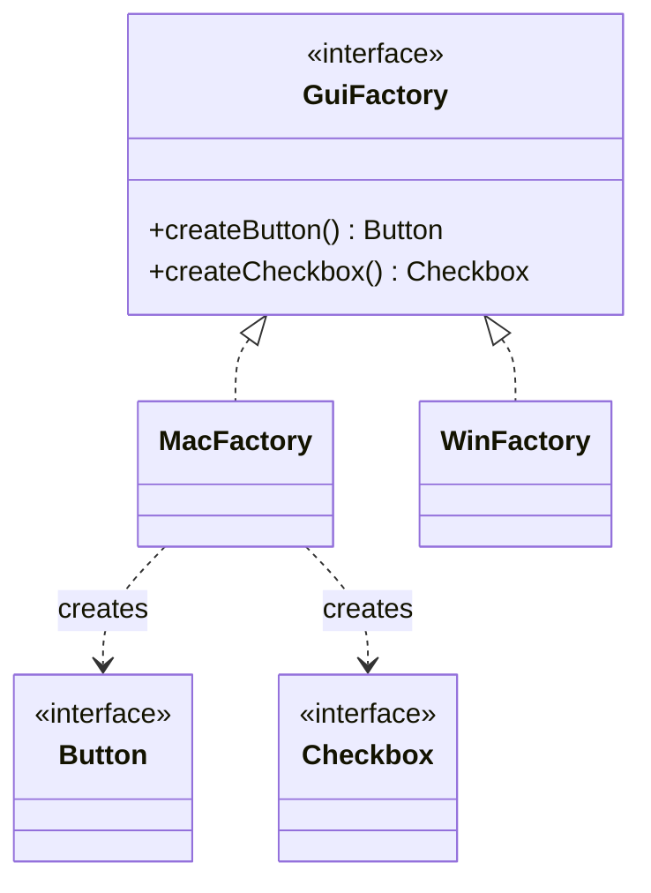

Factory Method scaled from one product to a family that has to be used together. This is one of the five patterns Kotlin gives you nothing for: no language feature expresses \"these objects must all come from the same set\".

<!--more-->

## Structure

