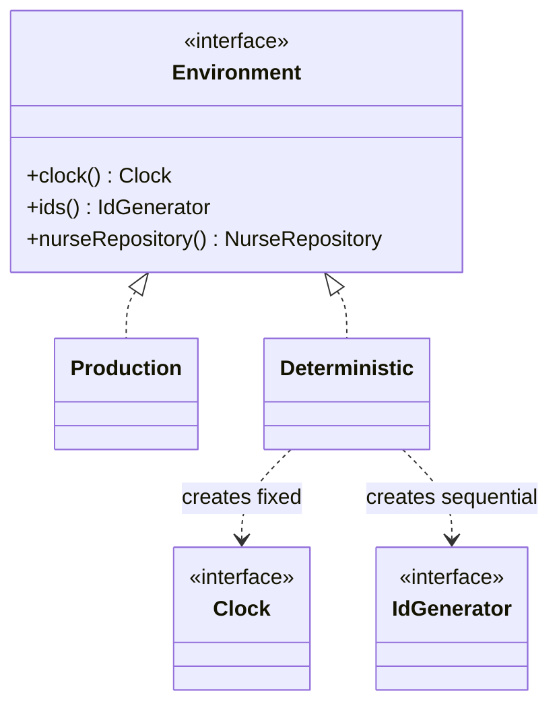

Factory Method scaled from one product to a family that has to be used together. This is one of the five patterns Kotlin gives you nothing for: no language feature expresses "these objects must all come from the same set".

<!--more-->

## The Problem

Wiring up a test:

```kotlin
val repo  = InMemoryNurseRepository()
val clock = SystemClock()             // real time
val ids   = RandomIdGenerator()       // random UUIDs
val service = ScheduleService(repo, clock, ids)
```

Every line compiles. Every line is individually reasonable. Together they are wrong: an in-memory repository with a real clock and random ids gives you a test that cannot be reproduced and a snapshot that never matches twice.

The constraint being violated is not about any one object. It is **"these three must come from the same world."** Nothing in the type system says so, so the rule lives in a wiki page, and every new test is a chance to get it wrong.

Now scale it. A design system where `Button`, `Checkbox` and `Slider` must all be the compact variant. A KMP module where the HTTP engine, the cache and the certificate pinner must all be the platform-appropriate ones. Same shape: **individually valid, collectively wrong.**

## Intent

> Provide an interface for creating families of related or dependent objects without specifying their concrete classes.

## Structure



## Kotlin

```kotlin
interface Environment {
    fun clock(): Clock
    fun ids(): IdGenerator
    fun nurseRepository(): NurseRepository
}

object Production : Environment {
    override fun clock() = SystemClock()
    override fun ids() = RandomIdGenerator()
    override fun nurseRepository() = PostgresNurseRepository(dataSource)
}

class Deterministic(private val start: Instant) : Environment {
    override fun clock() = FixedClock(start)
    override fun ids() = SequentialIdGenerator()
    override fun nurseRepository() = InMemoryNurseRepository()
}

fun scheduleService(env: Environment) =
    ScheduleService(env.nurseRepository(), env.clock(), env.ids())
```

The mismatched combination from the top of the page is now unconstructible. You pick a world once; the world hands you a consistent set.

Notice that each method of `Deterministic` is a factory method. **Abstract Factory is usually implemented as an object holding several Factory Methods** -- that is the structural relationship between the two, and the reason they are adjacent in the catalog.

Also notice that `Production` is an `object` while `Deterministic` is a `class`. Families that carry configuration are classes; families that do not can be singletons. That falls out naturally and is a small argument for the pattern: the *variation between worlds* has somewhere to live.

## Why Kotlin does not replace this one

Every other creational pattern in this module has a language answer -- `object`, `copy()`, default arguments. This one does not, and it is worth being precise about why.

The pattern encodes a **cross-object constraint**. Kotlin's type system can say "this parameter is a `Clock`". It cannot say "this `Clock` and that `IdGenerator` must have been produced by the same source". Expressing that needs either a runtime object that vends the whole set -- this pattern -- or a type-level tag threaded through every product, which is far more machinery than the problem is worth.

So Abstract Factory survives intact, and it shows up constantly under other names.

## In the Wild

- **Dagger `@Component`, Koin `module`, Hilt `@InstallIn`** -- a DI component *is* an abstract factory. `@TestInstallIn` swapping a whole module is exactly "pick a different world". This is where most Kotlin developers use the pattern daily without naming it.
- **Ktor `HttpClientEngineFactory`** -- CIO, OkHttp, Darwin: each engine vends its own matched set of connection machinery.
- **`javax.xml.parsers.DocumentBuilderFactory`** -- the JDK's canonical example, named after the pattern.
- **Compose `MaterialTheme`** -- colors, typography and shapes handed down as one coherent set. Not literally an interface with factory methods, but the same constraint expressed through composition locals.

## Consequences

**You get:** mismatched combinations become unconstructible, and swapping the whole world is one line.

**You pay:** a level of indirection, and a real asymmetry that decides whether this pattern fits.

**Adding a new *variant* is easy. Adding a new *product type* is hard.** A fourth environment is a new class. But adding `fun auditLog(): AuditLog` to `Environment` means editing every implementation of it. If your families are stable in membership and open in variants, this pattern is right. If you keep discovering new kinds of product, it will fight you at every step.

That asymmetry is not unique to Abstract Factory -- it is the same trade you will meet head-on in [Visitor]({{ "/design_patterns/m4-visitor/" | relative_url }}), where it has a name: the Expression Problem. Worth filing away now.

**Don't use it when:**

- There is only one family. You have written an interface with one implementation, which [Foundations]({{ "/design_patterns/m0-fundamentals/" | relative_url }}) says is pure cost.
- The products are genuinely independent. If any clock works with any repository, you do not have a family -- you have three separate dependencies, and constructor injection already handles them.
- A DI framework is already in the project. Its component or module *is* this pattern, and hand-writing a second one alongside it duplicates the concept.

## Factory Method or Abstract Factory?

|  | Factory Method | Abstract Factory |
|---|---|---|
| Products | One | A family that must match |
| Extension via | Inheriting the creator | Composing a factory object |
| A new variant costs | A creator subclass | A factory class |
| A new product type costs | Nothing | Editing every factory |
| Typical shape | A `protected abstract` hook | An interface passed in as a dependency |

The short version: **if the answer to "what else has to change when this changes?" is "nothing", you want Factory Method. If it is "these other two objects", you want Abstract Factory.**

## Exercise

Find a place in your tests where you construct three or more collaborators by hand and at least one of them has a fake or in-memory variant. Write the `Environment` interface for it, with a production and a deterministic implementation.

Then check the payoff honestly: how many test files were choosing that set by hand, and did any of them already have a mismatched combination in it? If the answer is "one file, no mismatches", you did not need the pattern -- and knowing that is the exercise.
