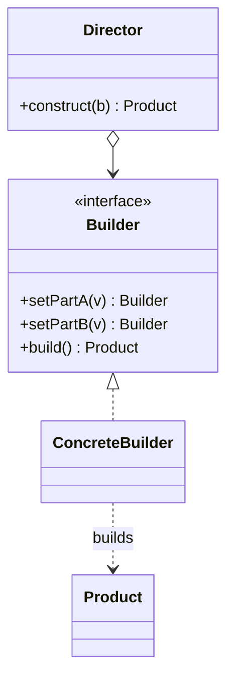

Kotlin takes most of this pattern away. Named and default arguments handle the ordinary case; what survives is step-by-step validation, type-safe builder DSLs, and Java interop. Worth studying precisely to see where the language stops helping.

<!--more-->

## Structure

