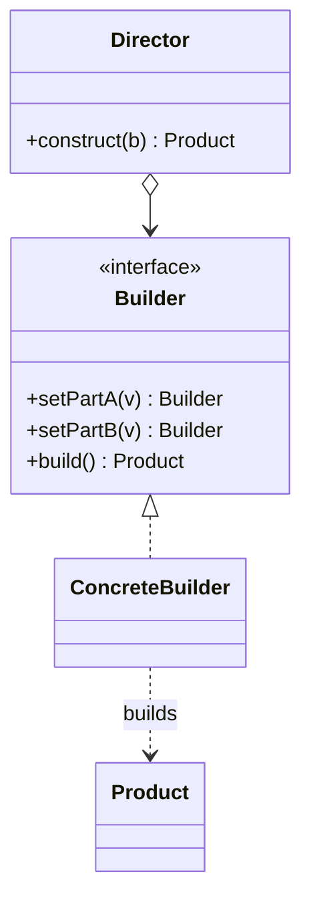

Kotlin takes most of this pattern away. Named and default arguments handle the ordinary case; what survives is step-by-step validation, type-safe builder DSLs, and Java interop. Worth studying precisely to see where the language stops helping.

<!--more-->

## The problem it was invented for -- and why that problem is gone

The original motivation was the telescoping constructor:

```java
new Schedule(month, nurses);
new Schedule(month, nurses, constraints);
new Schedule(month, nurses, constraints, timeLimit);
new Schedule(month, nurses, constraints, timeLimit, seed);
```

Unreadable at the call site, combinatorial in count, impossible to extend without another overload. Builder fixed it by turning parameters into named method calls.

Kotlin fixes the same problem in the language:

```kotlin
class Schedule(
    val month: Month,
    val nurses: List<Nurse>,
    val constraints: List<Constraint> = emptyList(),
    val timeLimit: Duration = 30.seconds,
    val seed: Long? = null,
)

Schedule(month, nurses, timeLimit = 2.minutes)
```

Named at the call site, no overloads, no extra type. **For the case Builder was invented to solve, writing a builder in Kotlin is strictly worse than not writing one.** That is the honest starting point. The rest of this page is the cases where it stops being true.

## Intent

> Separate the construction of a complex object from its representation, so that the same construction process can create different representations.

The second half gets dropped, and it is the half that still matters: **the same sequence of steps producing different results.**

## Structure



The `Director` is the piece everyone drops, and dropping it is exactly what reduces Builder to "a fluent setter chain". The director owns the *construction algorithm*; the builder owns the *representation*. Swap builders and the same algorithm emits XML instead of a `Schedule`.

## What survives in Kotlin

### 1. Incomplete intermediate state

Default arguments require every field to have a sensible default. When the object is genuinely invalid until several things arrive, a builder gives the half-built state somewhere to live.

```kotlin
class ScheduleBuilder {
    private var month: Month? = null
    private val constraints = mutableListOf<Constraint>()

    fun month(m: Month) = apply { month = m }
    fun require(c: Constraint) = apply { constraints += c }

    fun build(): Schedule {
        val m = requireNotNull(month) { "month is required" }
        require(constraints.none { it.conflictsWith(constraints) }) { "conflicting constraints" }
        return Schedule(m, constraints.toList())
    }
}
```

**The validation in `build()` is the point.** It sees the whole configuration at once, which a constructor with defaults cannot do -- each default is chosen in isolation, so no default can depend on another argument.

If you want that check at *compile* time, the step builder does it with types:

```kotlin
class NeedsMonth {
    fun month(m: Month) = NeedsNurses(m)
}
class NeedsNurses(private val month: Month) {
    fun nurses(n: List<Nurse>) = Ready(month, n)
}
class Ready(private val month: Month, private val nurses: List<Nurse>) {
    fun build() = Schedule(month, nurses)
}
```

`build()` does not exist until the required fields have been supplied. Verbose, and occasionally exactly right for a public API where misuse is expensive.

### 2. Type-safe builder DSLs

Here Kotlin does not replace Builder -- it supercharges it. Nested structure is what named arguments cannot express.

```kotlin
@DslMarker annotation class ScheduleDsl

fun schedule(month: Month, block: ScheduleScope.() -> Unit): Schedule =
    ScheduleScope(month).apply(block).build()

schedule(March) {
    ward("ICU") {
        night = 2
        day = 4
    }
    ward("General") {
        night = 1
        day = 3
    }
}
```

`@DslMarker` is the part worth knowing: it stops an inner scope from seeing the outer receiver's members, which is what makes `ward("ICU") { ward("Nested") { } }` fail to compile instead of silently doing something absurd. Gradle KTS, Ktor `routing`, kotlinx.html and Compose are all this shape.

### 3. Java interop and binary compatibility

Two reasons libraries still ship builders even in pure Kotlin.

Java callers have no named arguments, so what they get is `Schedule(month, nurses, null, null, 30_000L, null)`.

And **default arguments are part of your binary interface.** Adding a parameter in the middle, or reordering, breaks binary compatibility for anything compiled against the old signature. A builder's `fun timeLimit(d: Duration)` is additive forever. This is why OkHttp, Retrofit and AndroidX keep builders -- **it is a library-author constraint, not an application-author one.**

## In the Wild

- **`OkHttpClient.Builder`, `Retrofit.Builder`, `Request.Builder`** -- the binary-compatibility case
- **`AlertDialog.Builder`** -- predates Kotlin, and the reason every Android developer meets this pattern first
- **Gradle Kotlin DSL, Ktor `routing { }`, kotlinx.html** -- the `@DslMarker` case
- **`buildString`, `buildList`, `buildMap`** -- the standard library's own mini-builders

That last group shows the shape worth copying: **a mutable builder that exists only inside a lambda and hands back something immutable.** The mutable phase cannot escape, so there is no half-built object anyone can hold.

## Consequences

**You get:** readable construction of complex objects, one place to validate the whole configuration, and an API that grows without breaking callers.

**You pay:** a second type that mirrors the first. Every field exists twice and the two drift -- a field added to the product but not to the builder is the most common bug in hand-written builders, and nothing catches it.

**Don't use it when:**

- Fewer than four or five parameters and they all have sensible defaults. Named arguments already won.
- You reached for `apply { }` on a mutable object and called it a builder. No completeness check, no validation point, and the product stays mutable afterwards -- that is worse than a constructor.
- The object is flat. Builder earns its keep on *nested* structure.

## Exercise

Take a builder you use -- `OkHttpClient.Builder` is a good one -- and write down what it gives you that named arguments would not.

If the honest list is "it works from Java" and "it can add options without breaking ABI", you have found the real boundary: **in Kotlin, Builder is mostly a library author's tool, not an application author's.** That is a legitimate conclusion, not a failed exercise.
