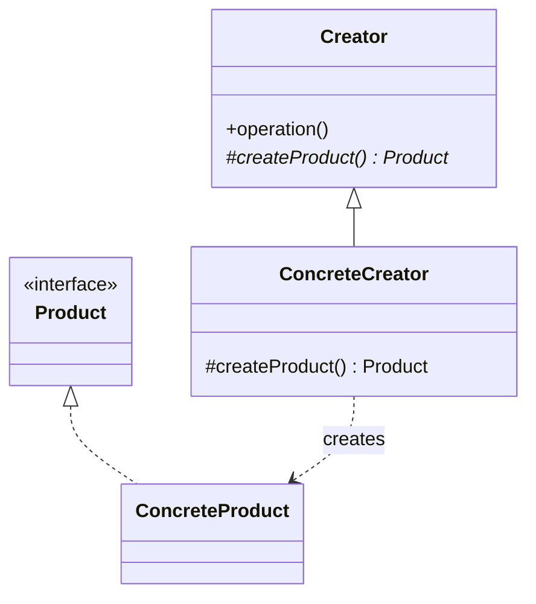

The first of the creational five. Calling a constructor binds you to a concrete type; Factory Method defers that choice to a subclass. Note that it produces one product -- the moment several products have to match each other, you have crossed into Abstract Factory.

<!--more-->

## First, three different things called "factory"

More confusion lives in this word than in any other pattern name, so it is worth clearing before anything else.

**Static factory method** (*Effective Java*, item 1). A named alternative to a constructor.

```kotlin
companion object {
    fun fromCsvRow(row: String): Nurse = ...
    operator fun invoke(id: String) = Nurse(NurseId(id))
}
```

Useful, idiomatic, and **not this pattern.** Nothing is deferred to anyone; there is no subclass and no polymorphism. It buys you a name, the freedom to return a cached instance or a subtype, and nothing else.

**Simple factory.** A function that branches on a discriminator.

```kotlin
fun rendererFor(format: Format): Renderer = when (format) {
    PDF  -> PdfRenderer()
    XLSX -> XlsxRenderer()
}
```

Also not this pattern. It is one `when`, which is fine -- it centralizes the branching in one place instead of scattering it, which is often all you need. Adding a format still means editing this function.

**Factory Method (GoF).** A `protected abstract` method on a base class, called by that base class, and overridden by subclasses to decide the concrete product. Extension happens by **subclassing the creator**, not by editing a `when`.

The rest of this page is about the third one.

## The Problem

A report job that has to fetch, render and upload. The sequence is identical for every report; only the renderer differs.

```kotlin
class PdfReportJob(private val storage: BlobStore) {
    fun run(month: Month): URL {
        val data = fetch(month)
        val renderer = PdfRenderer()          // bound to a concrete type
        val bytes = renderer.render(data)
        return storage.put("report-$month.pdf", bytes)
    }
}
```

`PdfReportJob` cannot be reused for XLSX without copying `run`, and `run` is where the interesting logic lives -- retries, partial failures, metrics. Copy it once and the two versions drift.

## Intent

> Define an interface for creating an object, but let subclasses decide which class to instantiate. Factory Method lets a class defer instantiation to subclasses.

## Structure



## The connection worth noticing

```kotlin
abstract class ReportJob(private val storage: BlobStore) {

    fun run(month: Month): URL {                       // the algorithm, fixed
        val data = fetch(month)
        val renderer = createRenderer()                // the one varying step
        val bytes = renderer.render(data)
        return storage.put("report-$month.${renderer.extension}", bytes)
    }

    protected abstract fun createRenderer(): Renderer  // the factory method
}

class PdfReportJob(storage: BlobStore) : ReportJob(storage) {
    override fun createRenderer() = PdfRenderer()
}
```

Look at the shape of `run`. Fixed skeleton, one `protected abstract` hook, control inverted so the base class calls down. **That is [Template Method]({{ "/design_patterns/m1-template-method/" | relative_url }}), and Factory Method is the special case where the hook returns an object.**

This is not a coincidence -- it is how GoF describe it. `Creator.operation()` in the canonical diagram *is* a template method. Once you see that, Factory Method stops being a separate thing to memorize and becomes a named use of something you already know.

## Idiomatic Kotlin

If the only thing the subclass contributes is the renderer, the subclass is ceremony:

```kotlin
class ReportJob(
    private val storage: BlobStore,
    private val createRenderer: () -> Renderer,
)

ReportJob(storage) { PdfRenderer() }
```

The hook became a parameter, and -- exactly as in Template Method -- **it turned into Strategy.** A factory function is just a strategy whose return value is an object.

`companion object` factories cover the other common need, naming a construction path:

```kotlin
class Schedule private constructor(private val slots: List<Slot>) {
    companion object {
        fun empty(month: Month) = Schedule(month.emptySlots())
        fun from(solution: CpSolution) = Schedule(solution.toSlots())
    }
}
```

Two named constructors that a plain `constructor` could not express, because both would have the same signature after erasure. That is the everyday reason to reach for a static factory, and it has nothing to do with the GoF pattern.

**When the GoF form still earns its keep:** the creator has real behavior that subclasses inherit and extend, and the product choice is one of several things a subclass decides. If the subclass exists *only* to pick a product, use a function parameter.

## In the Wild

- **`Iterable.iterator()`** -- the classic. Every collection is a creator; the iterator is the product.
- **Android `Activity.onCreateView`** -- the framework runs the lifecycle and calls down for the view.
- **`ThreadFactory`** -- often described as a factory method; it is really a strategy object, which tells you how blurred the line is in practice.
- **`AbstractMap.entrySet()`** -- a `protected abstract` product accessor, called by concrete methods on the base class.

## Consequences

**You get:** the algorithm written once, and a new product variant added by subclassing rather than by editing a `when`.

**You pay: parallel hierarchies.** Every new product tends to bring a new creator subclass, so two class hierarchies grow in lockstep. Ten renderers means ten job subclasses that each contain one line. This is the pattern's defining cost, and it is why the Kotlin form -- a factory lambda -- usually wins in application code.

**Don't use it when:**

- The subclass would contain nothing but `override fun create() = X()`. Pass a lambda.
- You only want to name a construction path. That is a static factory; write a `companion object` and move on.
- The set of products is closed and known. A single `when` in one place is honest and readable, and pretending it is a pattern does not improve it.

## Exercise

Find a `when` in your code that maps a type or format to a `new`. Ask which of the three "factories" it should be:

- Is the branching in **one** place, and the product set closed? Leave it. It is a simple factory and that is fine.
- Is the branching in one place but the product set open to callers outside your module? Take a factory lambda -- that is the Kotlin form.
- Does the surrounding class have real behavior that varies *together with* the product? Only then is the GoF subclassing form worth its parallel hierarchy.
