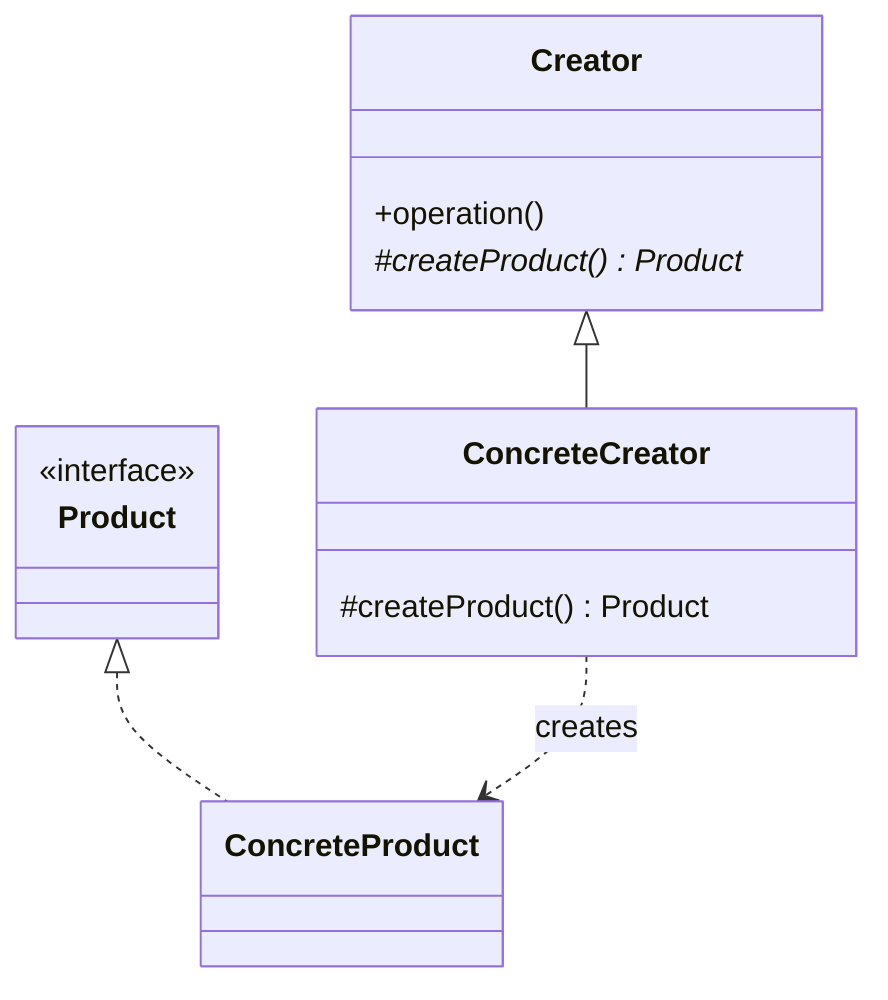

The first of the creational five. Calling a constructor binds you to a concrete type; Factory Method defers that choice to a subclass. Note that it produces one product -- the moment several products have to match each other, you have crossed into Abstract Factory.

<!--more-->

## Structure

