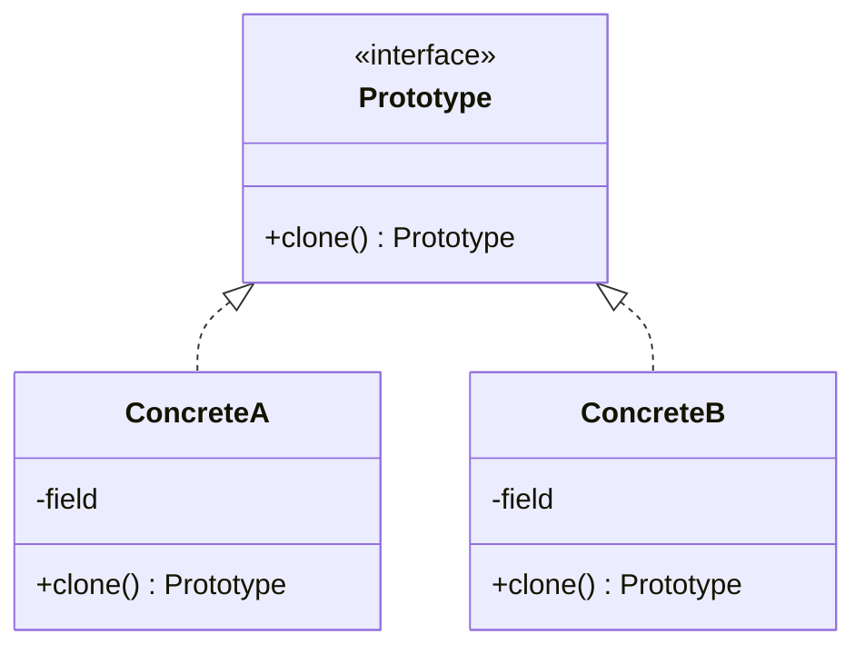

Copy an existing instance instead of constructing a new one. `data class` and `copy()` cover the shallow case outright, so the interesting question is what happens when the copy has to be deep.

<!--more-->

## Structure

