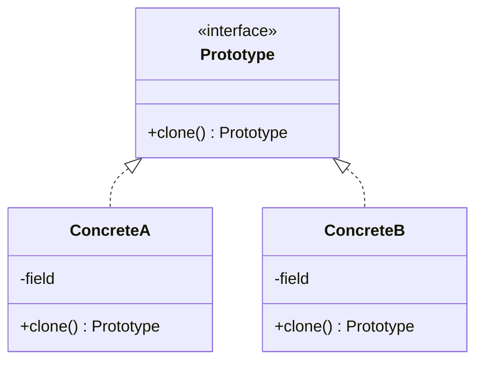

Copy an existing instance instead of constructing a new one. `data class` and `copy()` cover the shallow case outright, so the interesting question is what happens when the copy has to be deep.

<!--more-->

## The Problem

Two problems, actually, and separating them matters because only one survived.

**Gone: construction is expensive.** In 1994 building a configured object could mean parsing a file or hitting a database, and cloning a pre-built instance was the cheap way to get another. Allocation is fast now and configuration is rarely the bottleneck.

**Everywhere: you want *this* object, with one thing different.**

```kotlin
val marchPattern = ShiftPattern(
    ward = template.ward,
    nightStaff = 3,                     // the only difference
    dayStaff = template.dayStaff,
    weekendRule = template.weekendRule,
    holidayRule = template.holidayRule,
)
```

Five lines of copying to change one field, and each of them is a chance to copy the wrong thing -- or to forget a field entirely when a sixth is added.

## Intent

> Specify the kinds of objects to create using a prototypical instance, and create new objects by copying this prototype.

## Structure



## Kotlin

```kotlin
val marchPattern = template.copy(nightStaff = 3)
```

That is the entire pattern, compiler-generated for every `data class`. It is the most complete absorption in the catalog.

Worth knowing what Kotlin sidestepped. Java's version is `Cloneable`, which *Effective Java* spends a whole item telling you to avoid: a marker interface with no `clone` method on it, a `protected Object.clone` you must re-expose, no constructor invocation, and a contract `final` fields cannot satisfy. Kotlin did not fix `Cloneable` -- it routed around it with `copy()` on immutable data.

## The one thing that will bite you

**`copy()` is shallow.** The new instance shares every reference with the old one.

```kotlin
data class Roster(val ward: String, val nurses: MutableList<Nurse>)

val a = Roster("ICU", mutableListOf(kim))
val b = a.copy(ward = "General")

b.nurses += park
a.nurses            // [kim, park] -- a changed too
```

That is not a flaw in `copy()`; it is what shallow means. But it is the most common `data class` bug in Kotlin, and the fix is structural rather than a matter of being careful:

```kotlin
data class Roster(val ward: String, val nurses: List<Nurse>)   // read-only type
```

With immutable members there is no difference between a shallow and a deep copy, because nothing can be mutated through the shared reference. **The way to stop worrying about deep copies is to stop having mutable members**, not to write a deep-copy function.

When you genuinely must deep-copy a mutable graph -- an interop boundary, a third-party type -- write it by hand. Serializing to JSON and back is a tempting one-liner that silently drops transient fields, breaks object identity, and turns cycles into stack overflows.

## Prototype registry

The one place the classic form still earns its keep: a keyed set of pre-built specimens that callers clone.

```kotlin
object PatternLibrary {
    private val templates = mapOf(
        "icu" to ShiftPattern(ward = "ICU", nightStaff = 2 /* ... */),
        "general" to ShiftPattern(ward = "General", nightStaff = 1 /* ... */),
    )
    fun create(key: String, ward: String) = templates.getValue(key).copy(ward = ward)
}
```

Compare it with [Abstract Factory]({{ "/design_patterns/m2-abstract-factory/" | relative_url }}). Both hand you configured objects, but a factory **constructs** while a registry **copies a specimen**. That difference buys one real thing: the registry can gain a new kind at runtime -- load the templates from a file or a database -- with no new class and no recompile.

That is the only advantage Prototype has over the factories, and it is why it survives in editors, level designers, and document tooling where users define the templates.

## In the Wild

- **`data class.copy()`** -- and every reducer in an MVI or Redux architecture, which is `state.copy(...)` in a loop
- **`kotlinx.collections.immutable`** -- structural sharing is Prototype taken to its conclusion
- **Figma, Sketch, any design tool** -- "duplicate this component" is a prototype registry with a UI on it
- **`Intent`, `Bundle` copy constructors** on Android

## Consequences

**You get:** a new object differing from a known-good one by exactly what you named, with no chance of forgetting a field.

**You pay:** the shallow/deep question, permanently. Every `copy()` on a type with a mutable member is a latent aliasing bug.

**Don't use it when:**

- The object is cheap and has few fields. A constructor call says what it means; `copy()` on a two-field class hides which field changed.
- You are copying to work around shared mutable state. The copy treats a symptom; fix the mutability.
- The "prototypes" are really a fixed set of named configurations. That is a `companion object` with named factories, and it reads better.

## Exercise

Search for every `data class` in your code with a `MutableList`, `MutableMap`, or `var` member, then find every `copy()` call on those types.

For each, ask whether the caller expected the copy to be independent. The ones where the answer is "yes" are bugs that have not fired yet -- and converting the member to a read-only type fixes all of them at once. That is a much better trade than auditing call sites forever.
