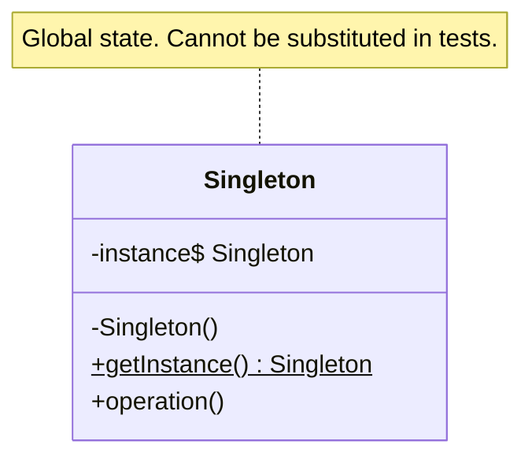

The pattern its own authors came to regret: global state that tests cannot replace. Kotlin's `object` reduces it to a single keyword, which makes it more dangerous, not less. Half of this session is about when to reach for dependency injection instead.

<!--more-->

## Structure

