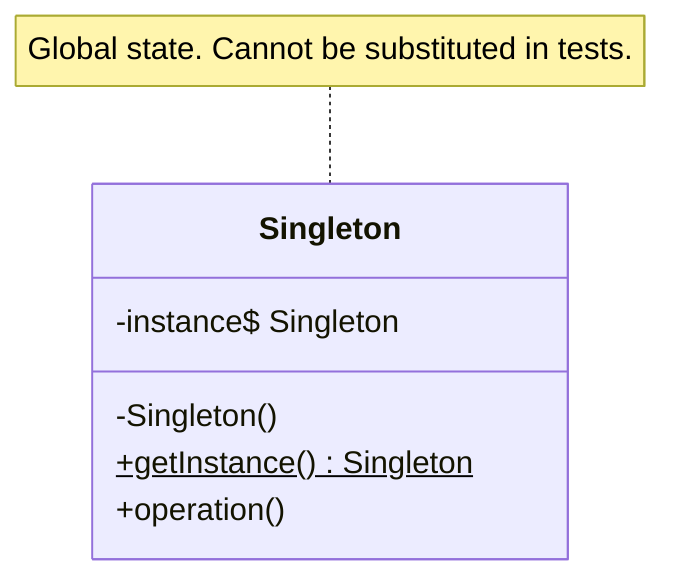

The pattern its own authors came to regret: global state that tests cannot replace. Kotlin's `object` reduces it to a single keyword, which makes it more dangerous, not less. Half of this page is about when to reach for dependency injection instead.

<!--more-->

## Intent, and the sleight of hand inside it

> Ensure a class has only one instance, and provide a global point of access to it.

Read that twice. It is **two** requirements joined by an "and", and they have nothing to do with each other.

1. **Uniqueness** -- there should be exactly one connection pool. This is usually a real requirement.
2. **Global access** -- anyone, anywhere, can reach it without being handed it. This is almost never a requirement; it is a convenience.

The pattern welds them together, and every problem attributed to Singleton comes from the second one. **Dependency injection gives you uniqueness without global access** -- one instance, handed to whoever needs it. That single observation is the whole argument, and the rest of this page is detail.

## Structure



## Kotlin

```kotlin
object ScheduleCache {
    private val entries = mutableMapOf<Month, Schedule>()
    fun get(month: Month) = entries[month]
    fun put(month: Month, s: Schedule) { entries[month] = s }
}
```

Java needed double-checked locking, a volatile field and a careful argument about the memory model. Kotlin gives you laziness and thread-safe initialization from one keyword -- `object` compiles to a static holder initialized on first class-load.

**The cost of that convenience is that nothing makes you think about it.** In Java, writing a singleton took enough ceremony to prompt the question "should this be one?". In Kotlin it is shorter than the alternative.

## Not every `object` is a problem

The pattern gets blanket condemnation, which is unhelpful because `object` is also the right tool several times a day. The distinction is not "is it a singleton" but **what it holds**.

**Fine.** Stateless things: a namespace of pure functions, a `Json` configuration, a comparator, `data object` cases in a sealed hierarchy. Nothing to leak between tests, nothing to race, nothing to substitute -- you cannot write a meaningful fake for a pure function.

```kotlin
object ShiftMath {
    fun nightsBetween(a: LocalDate, b: LocalDate): Int = ...
}
```

**Dangerous.** Anything holding mutable state -- a cache, a registry, a counter, a flag. State survives between tests in the same JVM, so test order starts to matter and the failure appears in whichever test happens to run second.

**Wrong, every time.** Anything that touches time, randomness, the network, the filesystem, or a database. Those are precisely the things a test needs to replace, and `object` is the one shape that cannot be replaced.

```kotlin
object Clock { fun now(): Instant = Instant.now() }   // now nothing can be tested
```

The rule that falls out: **`object` is for things with no state and no I/O.** Everything else is a dependency, and dependencies get passed in.

## What it actually costs

**Hidden dependencies.** A function that reaches for `ScheduleCache` has a dependency its signature does not mention. You discover it by reading the body, or by a test failing. Constructor parameters are a list of what a class needs; a singleton is a need that never made the list.

**Tests that cannot be isolated.** No seam to substitute at. The usual workaround -- adding a `reset()` for tests -- puts a method in production code whose only purpose is to undo the design, and it has to be called from every test that touches it, forever.

**Initialization order.** `object` initializes on first access, so the order depends on which code path runs first. Two objects referencing each other during initialization deadlock or observe half-built state, and the trigger changes when call order changes.

**On Android, specifically:** an `object` holding a `Context` leaks an Activity for the process lifetime. And `object` state does not survive process death, so a singleton that has been holding "the user's current selection" returns an empty one after the OS reclaims the app -- a bug that only appears on low-memory devices and never on the developer's.

## The alternative, concretely

```kotlin
// Before
object ScheduleCache { ... }
class ScheduleService {
    fun load(m: Month) = ScheduleCache.get(m) ?: fetch(m)
}

// After
interface ScheduleCache {
    fun get(month: Month): Schedule?
    fun put(month: Month, s: Schedule)
}

class ScheduleService(private val cache: ScheduleCache) {
    fun load(m: Month) = cache.get(m) ?: fetch(m)
}
```

There is still **one** cache in production -- the DI graph or the composition root sees to that. What changed is that `ScheduleService` no longer reaches out for it, and a test can hand it a fresh in-memory one.

Note the shape of the DI answer: a container's `@Singleton` scope means *one instance within this graph*, and a new graph means a new instance. Uniqueness without globality. It is worth seeing that a DI component is an [Abstract Factory]({{ "/design_patterns/m2-abstract-factory/" | relative_url }}) that also manages lifetimes -- which is why adopting DI tends to remove the need for this pattern entirely.

If DI is too much for the situation, the composition root alone does most of the work: build the one instance in `main` or `Application`, pass it down. That is not a pattern, it is just parameters, and it is usually enough.

## In the Wild

- **`Dispatchers.Main`, `Dispatchers.IO`** -- stateless routing objects, and note that `Dispatchers.setMain` exists precisely because even these needed a test seam
- **`Runtime.getRuntime()`, `Toolkit.getDefaultToolkit()`** -- the JDK's classic singletons, and both are routinely cited as untestable
- **Android `Application`** -- a framework-enforced singleton, which is why "put it on the Application class" became the default place to hide global state
- **Logging frameworks** -- the one case where global access is genuinely defensible, because a logger is write-only and its effects are not part of the behavior under test

## Consequences

**You get:** one instance, guaranteed, reachable from anywhere, with no wiring.

**You pay:** dependencies that do not appear in signatures, tests that share state, initialization order that depends on call order, and a design that cannot be varied later without touching every call site.

**Don't use it when:** it has mutable state, or touches time, randomness, or I/O. Which is to say: almost always.

## Exercise

List every `object` in your codebase. For each, answer two questions.

1. Does it hold mutable state, or touch time, randomness, or I/O?
2. If a test needed a different one, what would you do?

Any `object` where (1) is yes and the answer to (2) is "I can't" is the design working as intended and against you. Convert one of them to an interface plus constructor injection, and count how many files had to change -- **that number is how far the hidden dependency had spread**, and it is the most direct measure of the cost you will find.
