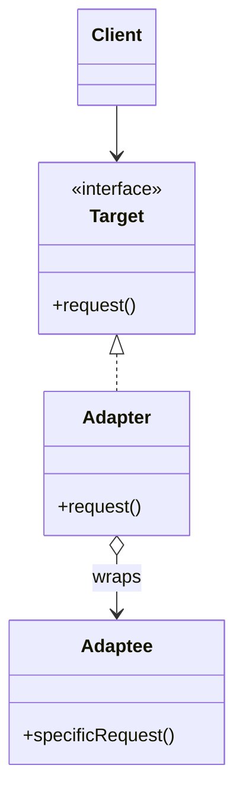

First of the four wrappers. All four wrap another object and forward calls; only their intent differs. Adapter is the one that *changes* the interface so two incompatible things can meet. Learn the four together or you will confuse them forever.

<!--more-->

## Structure

