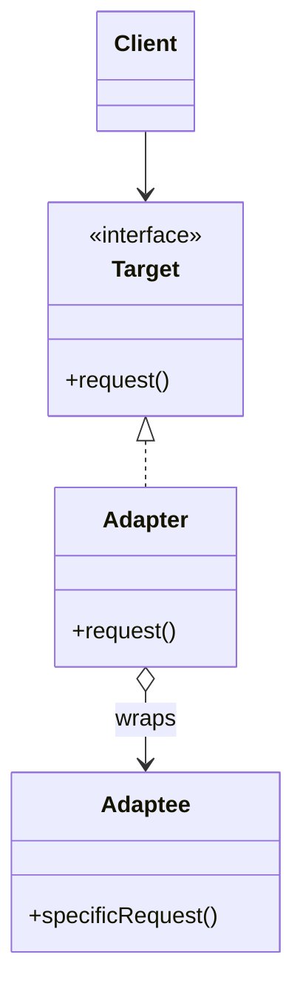

First of the four wrappers. All four wrap another object and forward calls; only their intent differs. Adapter is the one that *changes* the interface so two incompatible things can meet. Learn the four together or you will confuse them forever.

<!--more-->

## The Problem

You need a list of nurses. The hospital's HR system gives you this:

```kotlin
// third-party, cannot be changed
interface HrDirectory {
    fun queryStaff(deptCode: String, activeOnly: Boolean): Array<HrRecord>
}

class HrRecord {
    val empNo: String get() = ...
    val fullNameKanji: String get() = ...
    val licenceExpiry: Long get() = ...   // epoch millis
}
```

Your scheduler wants this:

```kotlin
interface NurseSource {
    fun nurses(ward: Ward): List<Nurse>
}
```

Neither side is wrong, and neither side is yours to change. Without an adapter, the scheduler ends up knowing about `empNo`, epoch millis and `activeOnly` -- and so does every test of the scheduler.

## Intent

> Convert the interface of a class into another interface clients expect. Adapter lets classes work together that couldn't otherwise because of incompatible interfaces.

The operative word is **convert**. The behavior on the other side stays exactly what it was; only the shape of the call changes.

## Structure



Note the two arrows that define it: the adapter **implements** what the client wants, and **holds** what it is adapting. Those are different types -- that is the whole tell. In [Decorator]({{ "/design_patterns/m3-decorator/" | relative_url }}) and [Proxy]({{ "/design_patterns/m3-proxy/" | relative_url }}) they are the same type.

## Kotlin

```kotlin
class HrNurseSource(private val hr: HrDirectory) : NurseSource {

    override fun nurses(ward: Ward): List<Nurse> =
        hr.queryStaff(ward.deptCode, activeOnly = true)
            .map { rec ->
                Nurse(
                    id = NurseId(rec.empNo),
                    name = rec.fullNameKanji,
                    licenceExpiresAt = Instant.ofEpochMilli(rec.licenceExpiry),
                )
            }
}
```

Nothing clever, and that is correct. **An adapter should be boring.** The moment it starts deciding things -- filtering out nurses on leave, defaulting a missing licence date to "far future" -- it has stopped adapting and started holding business logic, and it will be the last place anyone looks for that rule.

### The object adapter, and why Kotlin has no class adapter

GoF describe two forms. The one above is the **object adapter**: it holds the adaptee. The other is the **class adapter**, which inherits from both `Target` and `Adaptee` at once -- possible in C++ with multiple inheritance, and not in Kotlin or Java.

Kotlin gets close with interface delegation, when the adaptee already implements something usable:

```kotlin
class LoggingNurseSource(
    private val inner: NurseSource,
) : NurseSource by inner
```

But notice: that is not adapting anything, because the types match. **`by` delegation is the Decorator/Proxy tool. Adapters need the explicit mapping**, because the whole point is that the shapes differ.

## `asX()` versus `toX()`

Here is the part worth carrying around. Kotlin's standard library has a naming convention that encodes exactly this pattern:

```kotlin
list.asSequence()      // a view: wraps, lazy, shares the source
list.toSet()           // a conversion: copies, independent

map.asIterable()       // view
map.toList()           // copy

sequence.asStream()    // view
```

**`asX()` is Adapter.** It returns a wrapper that presents the same data through a different interface, backed by the original. Mutate the source and the view sees it.

**`toX()` is conversion.** It builds a new, independent thing.

That distinction is worth respecting in your own code, because it tells the caller whether the result aliases the source. And it sharpens the definition of this pattern: a mapping function like `HrRecord.toNurse()` is a *conversion*, not an adapter. The adapter is the object that implements `NurseSource` -- **adapting an interface means the client keeps calling through a type, not calling a converter and holding the result.**

## In the Wild

- **`InputStreamReader`** -- byte stream to character stream. The textbook example, and still the clearest.
- **`Arrays.asList()`, `Collection.asSequence()`, `Flow.asLiveData()`** -- the `asX()` family
- **`java.time` interop** -- `Instant.toKotlinInstant()`, `Date.toInstant()`; every boundary between two date libraries is an adapter layer
- **`RecyclerView.Adapter`** -- takes its *name* from this pattern but is structurally closer to [Template Method]({{ "/design_patterns/m1-template-method/" | relative_url }}): you extend an abstract class and fill in hooks, rather than wrapping an incompatible object. Worth knowing so the name does not mislead you about the pattern.

## Consequences

**You get:** two components that were never designed for each other, working together, with the incompatibility confined to one class you own.

**You pay:** one more type and one more hop, and a place where two models must be kept in sync. When the third party adds a field, the adapter is where you find out.

**The trap: the adapter that grows.** It starts as pure translation and accumulates a filter, then a default, then a cache. Now it is a translation layer, a business rule and a performance optimization in one file, and none of them are where anyone expects. If your adapter needs a unit test that is not about mapping, it is no longer an adapter.

**Don't use it when:**

- You control both sides. Change one of the interfaces -- an adapter between two of your own types is usually a design you have not finished.
- You only need the data in a different shape once. That is a mapping function; call it `toX()` and move on.
- You are wrapping to add behavior rather than to change shape. That is Decorator.

## Exercise

Find a boundary in your code with a third-party or legacy API on the other side, and check whether its vocabulary has leaked inward: search your domain code for the foreign type's names.

Every hit is a place the adapter should have stood and did not. **The measure of a good adapter is that the foreign type appears in exactly one file.**
