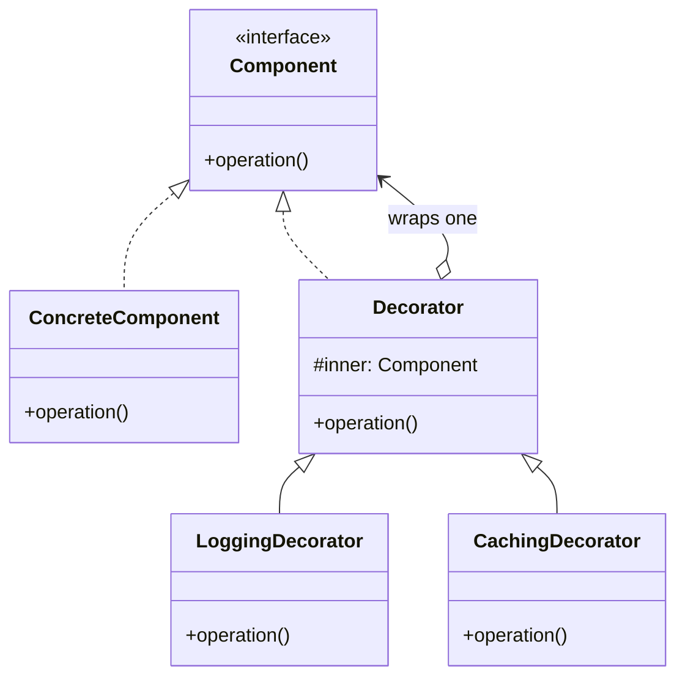

Keeps the interface and adds responsibility, and it stacks. Its diagram is identical to Proxy's -- the difference is that a decorator adds behavior while a proxy controls access to the same behavior. Kotlin's interface delegation makes a decorator a one-liner, which is why this is the wrapper you will actually reach for.

<!--more-->

## Structure

