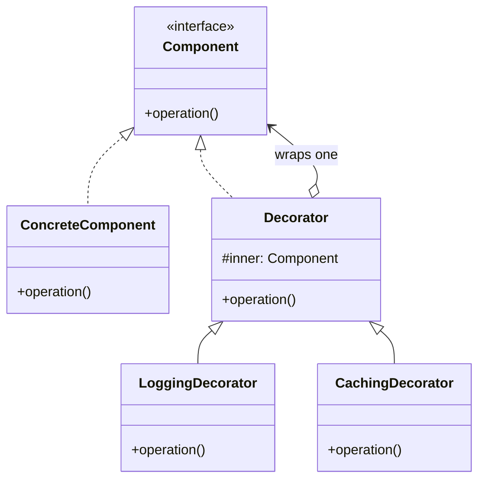

Keeps the interface and adds responsibility, and it stacks. Its diagram is identical to Proxy's -- the difference is that a decorator adds behavior while a proxy controls access to the same behavior. Kotlin's interface delegation makes a decorator a one-liner, which is why this is the wrapper you will actually reach for.

<!--more-->

## The Problem

A repository that needs caching. And logging. And retry. And metrics.

Inheritance gives you this:

```kotlin
class CachingNurseRepository : NurseRepository()
class LoggingNurseRepository : NurseRepository()
class CachingLoggingNurseRepository : ???
class CachingLoggingRetryingNurseRepository : ???
```

Four concerns is sixteen combinations, and you need a class for every one you actually use. The combinations are not a design; they are an accident of which features got requested together.

**The concerns are independent. Inheritance forces them into a single line of descent.**

## Intent

> Attach additional responsibilities to an object dynamically. Decorators provide a flexible alternative to subclassing for extending functionality.

## Structure



The decorator **implements** `Component` and **holds** a `Component`. Same type on both arrows -- which is why decorators nest, and why this diagram is indistinguishable from [Proxy]({{ "/design_patterns/m3-proxy/" | relative_url }})'s. Compare it with [Adapter]({{ "/design_patterns/m3-adapter/" | relative_url }}), where the two types differ.

## Kotlin

```kotlin
class CachingNurseRepository(
    private val inner: NurseRepository,
    private val cache: Cache<Ward, List<Nurse>>,
) : NurseRepository by inner {

    override fun byWard(ward: Ward): List<Nurse> =
        cache.getOrPut(ward) { inner.byWard(ward) }
}

val repo = CachingNurseRepository(
    LoggingNurseRepository(PostgresNurseRepository(ds)),
    cache,
)
```

`by inner` is the gift here. Override the one method you intercept; **every other member of the interface is delegated automatically.** In Java this pattern meant hand-writing twenty forwarding methods, and the real cost was not the typing -- it was that adding a method to the interface silently left every decorator forwarding an old shape until you found them all. `by` makes that impossible.

## Order is part of the design

This is the most practical thing on this page.

```kotlin
Logging(Caching(Real()))    // cache hits are logged
Caching(Logging(Real()))    // cache hits are not logged
```

Both compile. Both look right. They answer different questions -- "how many calls does the app make?" versus "how many calls reach the database?" -- and **nothing in the types tells you which one you built.**

You have met this already if you write Compose:

```kotlin
Modifier.padding(16.dp).background(Blue)   // padding outside the blue
Modifier.background(Blue).padding(16.dp)   // blue extends under the padding
```

`Modifier` is Decorator, exactly. Each call wraps the chain so far, the result implements the same type, and the order is visible in the output. Every Compose developer learns this by getting it backwards once.

OkHttp turned the same problem into API surface: `addInterceptor` runs outside the cache and redirect machinery, `addNetworkInterceptor` runs inside it. Two methods instead of one, because "where in the stack" was too important to leave to convention.

**When you build a decorator stack, write down what each layer is supposed to observe.** That is the specification; the nesting is just its encoding.

## The `by` delegation trap

Delegation is not inheritance, and the difference bites in one specific way.

```kotlin
interface Repo {
    fun byWard(ward: Ward): List<Nurse>
    fun byWards(wards: List<Ward>): List<Nurse>
}

class PostgresRepo : Repo {
    override fun byWard(ward: Ward) = query(ward)
    override fun byWards(wards: List<Ward>) = wards.flatMap { byWard(it) }   // self-call
}

class CachingRepo(private val inner: Repo) : Repo by inner {
    override fun byWard(ward: Ward) = cache.getOrPut(ward) { inner.byWard(ward) }
}
```

Call `CachingRepo.byWards(...)`. It delegates to `PostgresRepo.byWards`, which calls `byWard` -- **its own**, not the decorated one. The cache is bypassed and nothing warns you.

With inheritance the override would have been picked up, because there is one object. With delegation there are two, and the inner one has never heard of the outer. This is not a Kotlin bug; it is what wrapping means. The defence is to **keep decorated interfaces free of methods implemented in terms of each other**, or to decorate every method that participates.

## In the Wild

- **Compose `Modifier`** -- the one you use daily
- **`java.io` streams** -- `BufferedInputStream(GZIPInputStream(FileInputStream(f)))`, the example GoF themselves cite
- **Ktor client plugins** -- `install(Logging)`, `install(HttpTimeout)`, each wrapping the pipeline
- **`Collections.unmodifiableList`** -- worth arguing about: it adds no behavior, it *removes* it. That makes it closer to a protection proxy than a decorator, which is a good test of whether the distinction has landed.

## Consequences

**You get:** independent concerns that compose at runtime, N features as N classes instead of 2^N, and each feature testable alone.

**You pay:** many small objects, deep stack traces, and a loss of identity -- `decorated != original`, so anything keying on instance identity or doing a type check on the concrete class breaks. If some caller needs `is PostgresNurseRepository`, decorating will silently change behavior.

**Don't use it when:**

- There is one decoration and there always will be. Put it in the class.
- The decorator needs to know what it is wrapping. That coupling means the split is wrong.
- You are removing or restricting behavior rather than adding it. That is a protection [Proxy]({{ "/design_patterns/m3-proxy/" | relative_url }}).
- The wrapper may stop the call from reaching the next layer. That is [Chain of Responsibility]({{ "/design_patterns/m5-chain-of-responsibility/" | relative_url }}) -- a decorator always passes through.

## Exercise

Take a repository or client interface in your code and write two decorators for it with `by` delegation -- logging and caching are fine.

Then compose them in both orders and run the same call twice. The log output will differ. **Predict which order produces which output before you run it**; getting that prediction wrong is the fastest way to internalize that the nesting order is a design decision and not an implementation detail.
