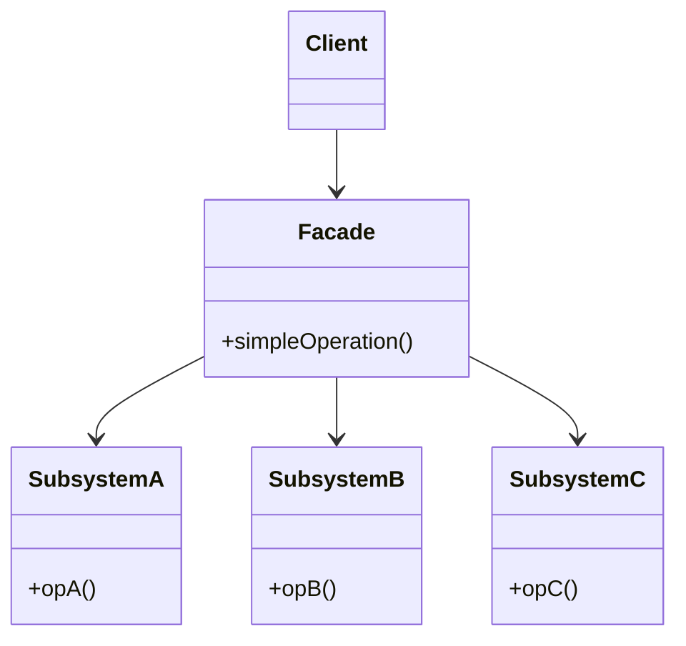

The odd one of the four wrappers: it preserves no existing interface, it invents a simpler one in front of a subsystem. That is also how you tell it from Adapter -- an adapter matches an interface somebody else defined, a facade defines its own.

<!--more-->

## The Problem

Generating a month's schedule touches six things in a specific order:

```kotlin
class ScheduleViewModel(
    private val nurses: NurseRepository,
    private val constraints: ConstraintRepository,
    private val modelBuilder: CpModelBuilder,
    private val solver: CpSolver,
    private val schedules: ScheduleRepository,
    private val notifier: Notifier,
) {
    fun generate(ward: Ward, month: Month) {
        val staff = nurses.activeIn(ward)
        val rules = constraints.forWard(ward) + constraints.statutory()
        val model = modelBuilder.build(staff, rules, month)
        val solution = solver.solve(model, timeLimit = 30.seconds)
        val schedule = solution.toSchedule(month)
        schedules.save(schedule)
        notifier.scheduleReady(ward, month)
    }
}
```

The view model has six dependencies and knows the order of seven steps. So does every test of it. And so will the next caller -- the admin tool, the nightly job, the API endpoint -- each reimplementing the sequence slightly differently.

**The knowledge that leaked is not any one component. It is how they fit together.**

## Intent

> Provide a unified interface to a set of interfaces in a subsystem. Facade defines a higher-level interface that makes the subsystem easier to use.

## Structure



Note what is missing: there is no `Target` interface the facade implements. It invents its own. That single absence separates it from the other three wrappers.

## Kotlin

```kotlin
class SchedulingService(
    private val nurses: NurseRepository,
    private val constraints: ConstraintRepository,
    private val modelBuilder: CpModelBuilder,
    private val solver: CpSolver,
    private val schedules: ScheduleRepository,
    private val notifier: Notifier,
) {
    suspend fun generate(ward: Ward, month: Month): Schedule { /* the seven steps */ }
}

class ScheduleViewModel(private val scheduling: SchedulingService) {
    fun generate(ward: Ward, month: Month) = viewModelScope.launch {
        scheduling.generate(ward, month)
    }
}
```

Six dependencies became one. The sequence lives in one place, and the three other callers get it for free.

### The Kotlin form worth knowing

You often do not need a facade *class* at all. A Gradle module with `internal` members and a few public entry points is the same idea, enforced by the compiler:

```kotlin
// scheduling/src/main/kotlin/…
internal class CpModelBuilder { ... }
internal class CpSolver { ... }

class SchedulingService(...) { ... }   // the only public type
```

Now the subsystem is not merely inconvenient to reach around -- it is **invisible** outside the module. A facade class gives you a convenient path; a module boundary gives you a guarantee. When you control the packaging, prefer the guarantee.

## The rule everyone breaks

GoF are explicit about this and it gets ignored: **a facade should hide the subsystem, not seal it off.** Clients that need the detail must still be able to reach past it.

That matters because a facade covers the common case by construction -- it is the *simple* interface. An unusual case will turn up: a solver run with a custom time limit, a schedule generated without notifying anyone. If the only way through is the facade, that case forces a new parameter onto `generate()`, and then another, until the simple interface is not simple.

The healthy version keeps the subsystem usable, with the facade as the convenient default. In a Kotlin module, this is the tension in the `internal` approach above -- sealing is a real guarantee, and it is also a real commitment. Seal what is genuinely an implementation detail; leave the composable pieces public.

## In the Wild

- **Retrofit** -- hides OkHttp, serialization, reflection-based proxies and call adapters behind `create<T>()`. And it honours the rule: you can still hand it your own `OkHttpClient`.
- **Room** -- SQLite, cursors, threading, migrations, all behind a DAO interface
- **Coil's `ImageLoader`** -- fetchers, decoders, memory and disk caches behind `load()`
- **`kotlinx.coroutines` `withContext`** -- dispatcher, job, cancellation and context propagation behind one call

Every one of them is a library's front door, which is the natural habitat of this pattern: **facades appear at module boundaries, not inside them.**

## Consequences

**You get:** callers decoupled from the subsystem's shape and its call order, one place to change the sequence, and the freedom to replace components behind it.

**You pay:** one more layer, and the risk that it becomes the place everything is added to.

**The two failure modes, both common:**

**The pass-through facade.** One facade method per subsystem method. It simplifies nothing -- it is a second copy of the same API, with all the maintenance and none of the benefit. If your facade's methods map one-to-one, you needed a module boundary, not a class.

**The facade that grows a brain.** It starts coordinating and begins deciding -- which ward to skip, when to retry, what counts as a conflict. Then it is a God Object with a polite name. **A facade sequences; it should not decide.** If it needs a branch that is not "did the previous step fail", the rule belongs in a component, not here.

**Don't use it when:**

- The subsystem has one entry point already. Wrapping one call in another call is pure cost.
- You want to change an interface to match one someone else defined. That is [Adapter]({{ "/design_patterns/m3-adapter/" | relative_url }}).
- There is exactly one caller and there always will be. The sequence can live in that caller until a second one shows up -- gate 1 from [Foundations]({{ "/design_patterns/m0-fundamentals/" | relative_url }}) applies here as everywhere.

## Exercise

Find the class in your code with the most constructor parameters. Look at what it actually does with them: if several are used together, in a fixed order, to accomplish one named thing, that sequence is a facade waiting to be extracted.

Then check the payoff the honest way -- **how many other places already reimplement that same sequence?** If the answer is zero and no second caller is coming, leave it where it is.
