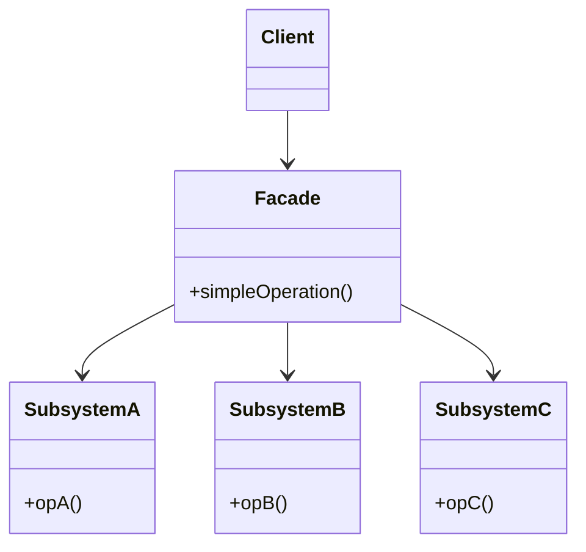

The odd one of the four wrappers: it preserves no existing interface, it invents a simpler one in front of a subsystem. That is also how you tell it from Adapter -- an adapter matches an interface someone else defined, a facade defines its own.

<!--more-->

## Structure

