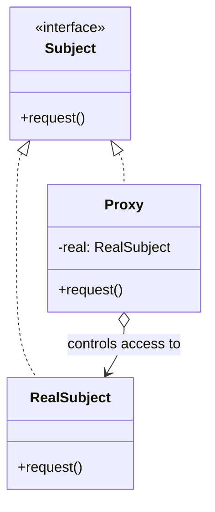

Structurally identical to Decorator, with a different job: the same face, controlled access. If you are adding behavior it is a decorator; if you are deciding whether, when, or for whom the original behavior runs, it is a proxy.

<!--more-->

## Intent

> Provide a surrogate or placeholder for another object to control access to it.

GoF list four kinds, and they are worth keeping as a checklist because "proxy" on its own is too vague to be useful:

| Kind | Controls | Kotlin |
|---|---|---|
| **Virtual** | *when* the real object is created | `by lazy` |
| **Remote** | *where* it lives | Retrofit's `create<T>()` |
| **Protection** | *who* may call it | hand-written, or a DI-swapped implementation |
| **Smart reference** | *what else happens* on access | `Delegates.observable`, reference counting |

## Structure



Same shape as [Decorator]({{ "/design_patterns/m3-decorator/" | relative_url }}). No diagram will ever separate them.

## Telling it from Decorator

Two tests, and the second one is the more reliable.

**By intent.** A decorator *adds* a responsibility the original did not have. A proxy provides the *same* responsibility and decides whether, when, or for whom it runs. Logging is a decorator; permission checking is a proxy; caching is arguable and that is fine -- it adds no behavior but changes when the real call happens, which is why most people call it a proxy.

**By who owns the subject.** A decorator is assembled from outside: the caller builds the chain and hands it in, and the decorator neither creates nor owns what it wraps. A proxy usually **creates or manages** its subject -- that is how a virtual proxy can defer construction and a remote proxy can have no local subject at all.

```kotlin
// Decorator: the caller supplies the thing being wrapped
class LoggingRepo(private val inner: Repo) : Repo by inner

// Proxy: the wrapper owns the lifecycle
class LazyRepo(private val create: () -> Repo) : Repo {
    private val real by lazy(create)
    override fun byWard(w: Ward) = real.byWard(w)
}
```

If you cannot decide, ask: **could the wrapper exist without the subject already being built?** Only a proxy can.

## Kotlin

The virtual proxy is a language feature:

```kotlin
class ScheduleScreen {
    private val solver by lazy { CpSolver() }   // expensive; built on first use
}
```

`by lazy` is thread-safe by default (`LazyThreadSafetyMode.SYNCHRONIZED`), which is the part people change without reading -- `NONE` is faster and correct only when you know the access is confined to one thread.

The remote proxy is where Kotlin leans on the JDK, and you use it every day:

```kotlin
interface ScheduleApi {
    @GET("wards/{id}/schedule") suspend fun schedule(@Path("id") id: String): ScheduleDto
}

val api = retrofit.create(ScheduleApi::class.java)
```

There is no class implementing `ScheduleApi` anywhere in your project. Retrofit builds one at runtime with `java.lang.reflect.Proxy`, and every method call becomes an HTTP request. **That is the pattern in its purest form: an object that looks exactly like the subject and is not it.**

Protection proxies are the one kind you still hand-write:

```kotlin
class AuthorizedScheduleRepo(
    private val inner: ScheduleRepo,
    private val session: Session,
) : ScheduleRepo by inner {

    override fun update(s: Schedule) {
        require(session.canEdit(s.ward)) { "not permitted" }
        inner.update(s)
    }
}
```

Note the shape: same interface, same operation, a gate in front. Nothing new is added -- access is controlled.

## The failure mode that matters

A proxy's whole promise is that it is indistinguishable from the subject. It never quite is, and the gaps are where bugs live.

**Identity and equality.** `proxy == real` is false. `proxy::class` is not the subject's class. Anything doing a type check or using the object as a map key behaves differently.

**Cost appears at an unexpected moment.** `by lazy` moves construction to first use -- which might be inside a composition, on the main thread, during a frame. The work did not go away; it moved somewhere you did not measure.

**Remote proxies lie about failure.** This is the serious one. A local call either returns or throws a bug in your code. A remote call can time out, half-succeed, or succeed after the caller gave up -- and the proxy presents it through an interface that looks local. Waldo and colleagues wrote *A Note on Distributed Computing* about exactly this: latency, partial failure and concurrency cannot be abstracted away, and pretending otherwise produces systems that work in testing and fail in production.

Retrofit handles it honestly by making the difference visible -- `suspend`, so callers must be in a coroutine, and exceptions that are obviously about I/O. **A remote proxy that hides the fact of remoteness is a liability; one that hides only the mechanics is an asset.**

## Consequences

**You get:** lazy construction, access control, and remoting without callers changing.

**You pay:** indirection, broken identity, and a place where "it behaves like the real thing" is true up to the point where it is not.

**Don't use it when:**

- The object is cheap. `by lazy` on a `data class` costs more than it saves.
- You are adding behavior rather than gating it. That is Decorator.
- The interface differs from the subject's. That is Adapter.

## The four wrappers, settled

| | Implements | Holds | Purpose |
|---|---|---|---|
| **Adapter** | Target | **Adaptee** (different type) | Make incompatible things fit |
| **Decorator** | Component | Component (**same type**) | Add responsibility, stackable |
| **Proxy** | Subject | Subject (**same type**) | Control access to the same behavior |
| **Facade** | *nothing existing* | several subsystems | Invent a simpler interface |

Read the first two columns and three of the four separate themselves. Adapter's types differ; Facade implements nothing pre-existing. **Only Decorator and Proxy have identical structure, and only intent tells them apart** -- which is the single most useful thing this module has to teach.

## Exercise

Find a `by lazy` in your code and answer two questions: what is the first call that triggers it, and what thread is that call on?

If you cannot answer either quickly, you have a virtual proxy whose cost you have not located -- and moving expensive construction to an unknown moment on an unknown thread is how a proxy stops being free.
