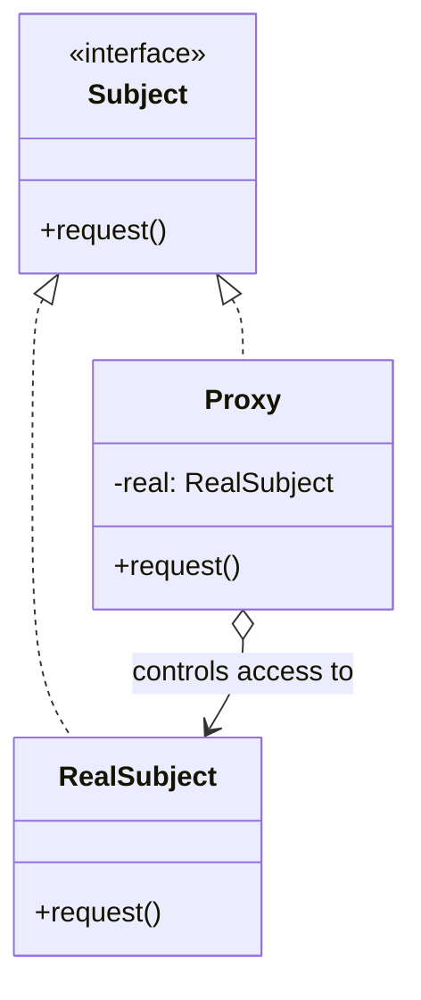

Structurally identical to Decorator, with a different job: the same face, controlled access. If you are adding behavior it is a decorator; if you are deciding whether, when, or for whom the original behavior runs, it is a proxy.

<!--more-->

## Structure

