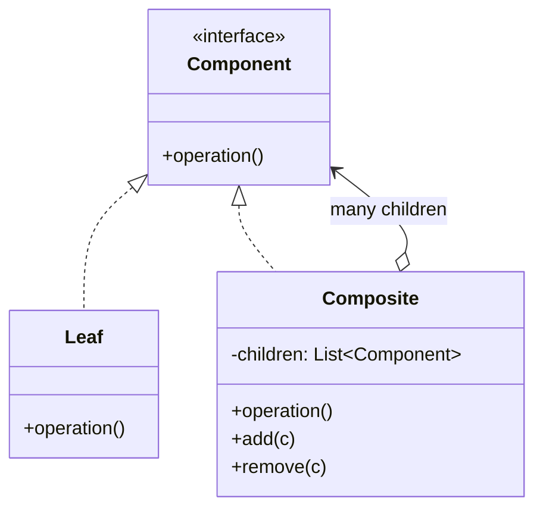

Opens the tree module. Treat a leaf and a branch through the same interface and recursion becomes possible. Everything else in this module operates on the tree that Composite creates -- Iterator walks it, Visitor adds operations to it, Interpreter is the special case where the tree is a grammar.

<!--more-->

## Structure

