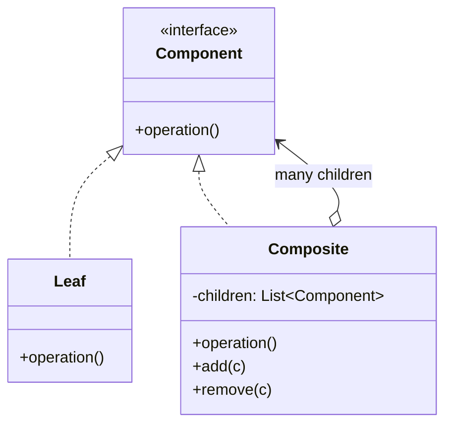

Opens the tree module. Treat a leaf and a branch through the same interface and recursion becomes possible. Everything else in this module operates on the tree that Composite creates -- Iterator walks it, Visitor adds operations to it, Interpreter is the special case where the tree is a grammar.

<!--more-->

## The Problem

Scheduling constraints come in two shapes. Some are single rules -- "no more than three night shifts in a row". Some are groups -- "satisfy all of these", "satisfy at least one of these". Without a common type, every caller has to know which is which:

```kotlin
fun evaluate(c: Any, schedule: Schedule): Boolean = when (c) {
    is SingleRule    -> c.check(schedule)
    is AllOfGroup    -> c.children.all { evaluate(it, schedule) }
    is AnyOfGroup    -> c.children.any { evaluate(it, schedule) }
    else             -> error("unknown constraint")
}
```

And so does the code that renders constraints, the code that serializes them, the code that counts them. **The tree shape leaks into every operation**, and each one re-derives the recursion slightly differently.

## Intent

> Compose objects into tree structures to represent part-whole hierarchies. Composite lets clients treat individual objects and compositions of objects uniformly.

## Structure



Contrast with [Decorator]({{ "/design_patterns/m3-decorator/" | relative_url }}), whose diagram is nearly this one: a decorator wraps **one** child and adds behavior; a composite holds **many** and aggregates them.

## The trade-off GoF had to pick a side on

Look at `add` and `remove` in that diagram. They are on `Composite`. GoF spend a page on where they should go, and it is the most interesting thing about this pattern.

**Put them on `Component`** and clients treat leaves and composites identically -- full *transparency*. But `Leaf.add(x)` has to exist and do something, and the only options are to fail at runtime or silently do nothing. You have bought uniformity with a lie.

**Put them on `Composite` only** and the types are honest -- full *safety*. But now clients must downcast to add a child, so they are back to distinguishing the two cases, which is what the pattern was for.

GoF chose transparency and accepted the runtime failure. That was the right call in 1994 and it is not the right call now, because **Kotlin makes the choice unnecessary**:

```kotlin
sealed interface Constraint {
    data class Rule(val spec: RuleSpec) : Constraint
    data class AllOf(val children: List<Constraint>) : Constraint
    data class AnyOf(val children: List<Constraint>) : Constraint
}

fun Constraint.satisfiedBy(s: Schedule): Boolean = when (this) {
    is Rule  -> spec.check(s)
    is AllOf -> children.all { it.satisfiedBy(s) }
    is AnyOf -> children.any { it.satisfiedBy(s) }
}
```

Child management lives only where children exist, so there is no lying leaf. Clients still distinguish the cases -- but the compiler checks the distinction is complete, so it costs nothing and a new node type becomes a compile error everywhere it matters.

**That is safety and transparency at once, which GoF could not have.** It is the clearest example in the catalog of a language feature dissolving a documented trade-off rather than merely shortening the code.

Worth noting the price, because every sealed hierarchy pays it: adding an *operation* is cheap -- one more function with one more `when` -- while adding a *node type* means every existing `when` has to change. The compiler names them all, which makes that direction manageable rather than free. That is the [Visitor]({{ "/design_patterns/m4-visitor/" | relative_url }}) trade-off rather than its reverse, and the next session is about why the two land on the same side.

## The traps

**Parent references.** The moment something needs to walk *up* the tree, the obvious move is a `parent` field -- which creates a cycle, makes the structure unusable as immutable data, and breaks `equals`, `hashCode` and `toString` on `data class` in one go. The alternative is to carry the path during traversal:

```kotlin
fun Constraint.paths(prefix: List<Constraint> = emptyList()): Sequence<List<Constraint>> = sequence {
    val here = prefix + this@paths
    yield(here)
    children().forEach { yieldAll(it.paths(here)) }
}
```

The parent lives in the traversal, not in the node. Slightly more work at the call site, and it keeps the tree a value.

**Recursion depth.** A recursive walk over a user-built tree is a stack overflow waiting for a pathological input. Bounded depth by construction is the usual answer; an explicit work-list is the fallback.

**Update cost.** Changing one leaf of an immutable tree rebuilds every node from there to the root. That is correct and usually fine -- and it is exactly why persistent collections with structural sharing exist. For a tree large enough that this matters, you are looking for `kotlinx.collections.immutable`, not for mutability.

## In the Wild

- **`kotlinx.serialization`'s `JsonElement`** -- `JsonPrimitive` as leaf, `JsonObject` and `JsonArray` as composites, the whole thing a sealed hierarchy. The cleanest Kotlin example there is.
- **Compose's node tree** and the classic `View` / `ViewGroup` hierarchy -- `ViewGroup extends View` is textbook Composite, transparency variant included
- **File systems** -- the example everyone reaches for, and still a good one
- **Gradle task and project trees**

## Consequences

**You get:** recursion expressed once, clients that mostly do not care about the shape, and arbitrary nesting for free.

**You pay:** a structure that is easy to make too general. If every node can contain every other node, the type says nothing about what is actually valid, and the validation you removed from the types reappears as runtime checks.

**Don't use it when:**

- The nesting is fixed and shallow. Two levels is a list of lists, not a tree.
- Leaves and composites genuinely need different operations. Forcing one interface over them produces methods that are meaningless for half the type.
- You are wrapping one child to add behavior. That is Decorator.

## Exercise

Find a recursive structure in your code -- a menu, a filter, a layout, a settings tree -- and check how many places re-derive the recursion by branching on node type.

Then convert it to a sealed hierarchy with one recursive function per operation. **The number of `else ->` branches you delete is the amount of runtime failure the types just absorbed.**
