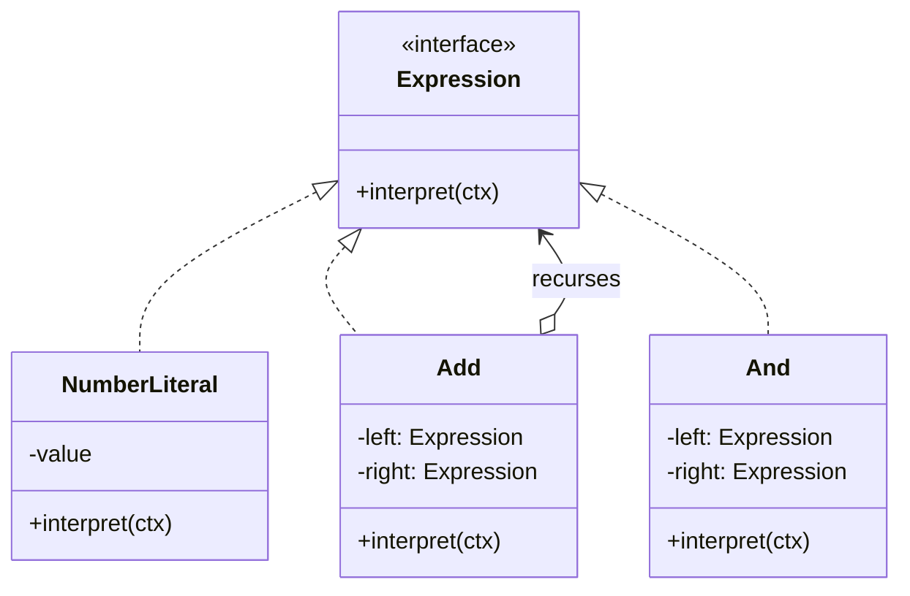

Composite applied to a grammar. Build the sentence as a tree of expression nodes and evaluate recursively. Rare in application code and unavoidable the moment you need a filter language, a rules engine, or a query DSL of your own.

<!--more-->

## Structure

