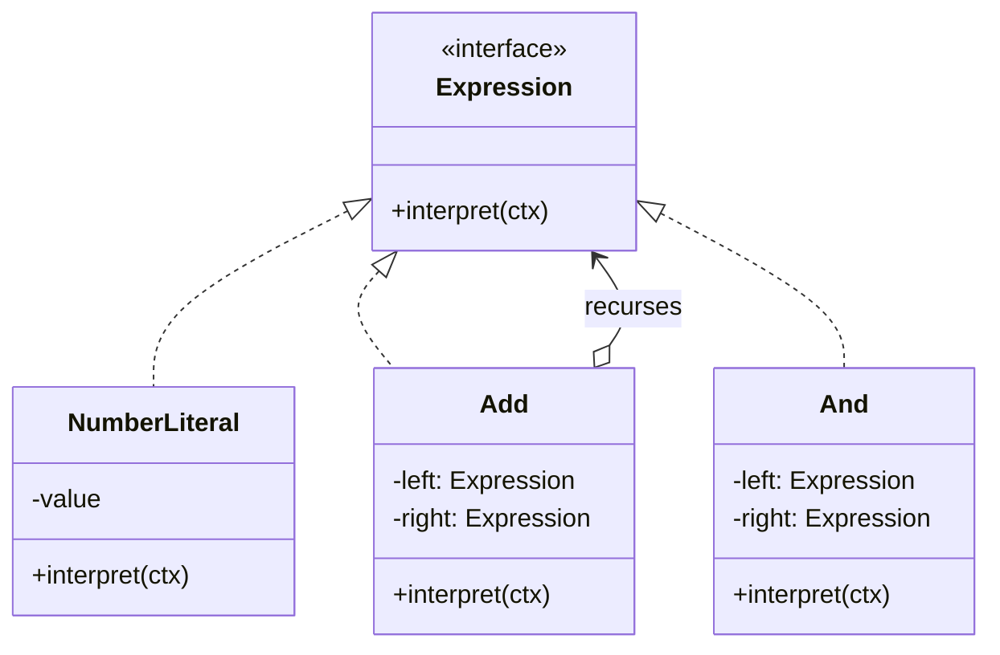

Composite applied to a grammar. Build the sentence as a tree of expression nodes and evaluate recursively. Rare in application code and unavoidable the moment you need a filter language, a rules engine, or a query DSL of your own.

<!--more-->

## The Problem

Shift-assignment rules start as code:

```kotlin
fun eligible(n: Nurse, shift: Shift) =
    n.ward == shift.ward && n.seniority >= 3 && !n.isOnLeave(shift.date)
```

Then a hospital asks for a rule you did not anticipate. Then another hospital asks for a different one. Then someone asks to see the rules in the admin UI, and to change one without a release.

The moment **the rules have to outlive the build**, they stop being code and become data. And data that has structure -- `AND`, `OR`, comparisons, nesting -- is a language, whether or not you decided to design one.

## Intent

> Given a language, define a representation for its grammar along with an interpreter that uses the representation to interpret sentences in the language.

One clarification that saves confusion: **Interpreter is not about parsing.** GoF's pattern covers representing the grammar as a class hierarchy and evaluating it. Turning text into that tree is a separate problem with separate tools. You can use this pattern with a builder DSL, a JSON schema, or a UI, and never write a parser.

## Structure



That is [Composite]({{ "/design_patterns/m4-composite/" | relative_url }}) with a specific job. Terminals are leaves, non-terminals are composites, and `interpret` is the recursive operation. The difference is not structural -- it is that the tree means something in a grammar.

## Kotlin

```kotlin
sealed interface Rule {
    data class WardIs(val ward: Ward) : Rule
    data class SeniorityAtLeast(val years: Int) : Rule
    data class Not(val inner: Rule) : Rule
    data class All(val of: List<Rule>) : Rule
    data class Any(val of: List<Rule>) : Rule
}

data class Ctx(val nurse: Nurse, val shift: Shift)

fun Rule.eval(ctx: Ctx): Boolean = when (this) {
    is WardIs            -> ctx.nurse.ward == ward
    is SeniorityAtLeast  -> ctx.nurse.seniority >= years
    is Not               -> !inner.eval(ctx)
    is All               -> of.all { it.eval(ctx) }
    is Any               -> of.any { it.eval(ctx) }
}
```

Twenty lines, and the rules are now values: serializable, storable, diffable, testable, and editable without a release.

The `Ctx` parameter is the piece GoF are explicit about and everyone forgets. **Every terminal needs the same context, so it belongs in one place, threaded through the recursion** -- not captured in the nodes, which would make them non-serializable and non-comparable.

## Why the tree is worth more than the evaluation

Having the rules as data, rather than as a lambda, is the real payoff -- because evaluation is only the first operation.

```kotlin
fun Rule.describe(): String = when (this) {
    is WardIs           -> "works in ${ward.name}"
    is SeniorityAtLeast -> "has $years+ years"
    is Not              -> "not (${inner.describe()})"
    is All              -> of.joinToString(" and ") { it.describe() }
    is Any              -> of.joinToString(" or ")  { it.describe() }
}

fun Rule.toSqlWhere(): String = when (this) { /* ... */ }
fun Rule.simplify(): Rule = when (this) {
    is Not -> (inner as? Not)?.inner?.simplify() ?: Not(inner.simplify())
    is All -> All(of.map { it.simplify() }.filter { it != All(emptyList()) })
    else   -> this
}
```

Explain a rule to a nurse. Push it into the database as a `WHERE` clause instead of filtering in memory. Simplify it before storing. **A lambda can do exactly one of these.** The tree is what makes the rest possible, and each new operation is one more `when` -- the [Visitor]({{ "/design_patterns/m4-visitor/" | relative_url }}) trade-off from the previous page, now paying off.

## The limit GoF state themselves

The class-per-production approach does not scale. A grammar with fifty productions is fifty types, and the recursive-descent evaluation buried in them becomes unreadable and slow.

GoF say so directly: use this for **simple grammars**. Beyond that the tools are different -- a parser generator, or a proper compiler pipeline with separate parse, analysis and evaluation phases. The pattern is for a filter language, not for a programming language.

Two practical signals you have crossed the line: you need operator precedence rules you cannot express by construction, or you have started evaluating the same subtree repeatedly and want caching. Both mean the grammar has outgrown the pattern.

## In the Wild

- **Exposed's `Op<Boolean>`** -- `(Users.age greaterEq 18) and (Users.city eq "Seoul")` builds an expression tree, and `toSqlWhere` is a second operation over it. Textbook.
- **`Regex`** -- a pattern string compiled into a tree the engine evaluates
- **Feature-flag and targeting rule engines** -- almost always this pattern, usually stored as JSON
- **kotlinx.serialization's `JsonElement`** -- the tree; JSONPath-style query libraries over it are the interpreter

## Consequences

**You get:** rules as data -- storable, editable at runtime, explainable, transformable, and open to as many operations as you want.

**You pay:** one class per production, recursion depth proportional to nesting, and a second language in your codebase that needs its own tests, its own versioning, and its own error messages when a stored rule no longer parses.

That last one is underrated: **the moment rules are persisted, you have a schema migration problem.** A `Rule` serialized last year has to still deserialize after you rename a variant.

**Don't use it when:**

- The rules are fixed at build time. A function is better in every way.
- You need one operation and it is evaluation. Store a lambda.
- The grammar is non-trivial. Reach for a parser generator.

## Exercise

Find a place where your code branches on configuration -- a feature flag with conditions, a filter, an eligibility check -- and write the sealed hierarchy that would represent those conditions as data.

Then write the second operation: `describe()`, returning a human-readable sentence. **If that second operation feels like it earns its keep, you have found a real use for this pattern. If it does not, the branch should stay a function** -- and knowing which you have is worth more than the implementation.
