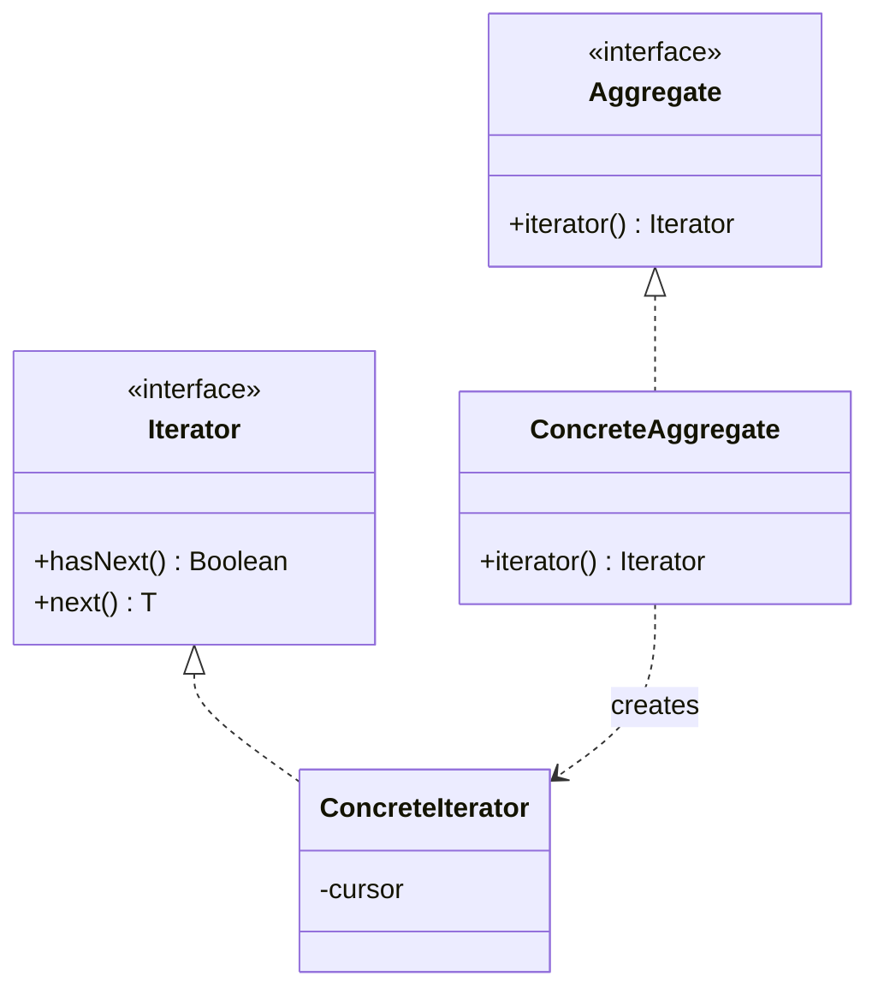

Walking the structure without exposing it. Kotlin ships this as `Iterable` and `Sequence`, so the point of studying it is the contract -- who owns the cursor, what happens when the collection changes mid-walk -- not the implementation.

<!--more-->

## Structure

