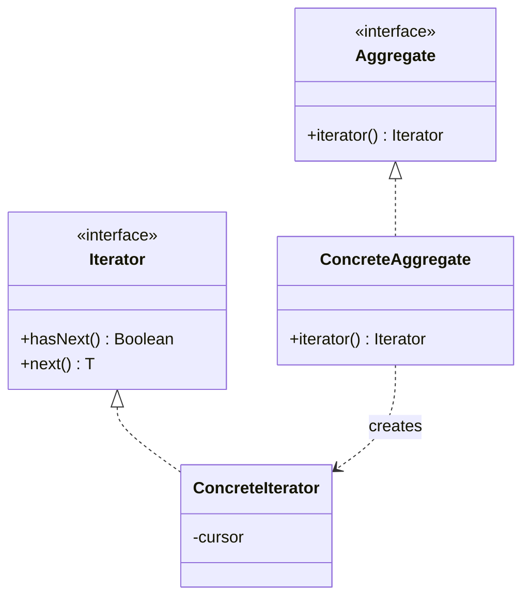

Walking the structure without exposing it. Kotlin ships this as `Iterable` and `Sequence`, so the point of studying it is the contract -- who owns the cursor, what happens when the collection changes mid-walk -- not the implementation.

<!--more-->

## Intent

> Provide a way to access the elements of an aggregate object sequentially without exposing its underlying representation.

`for (x in xs)` has made this invisible, so the useful material here is the set of decisions the pattern forces, all of which you still make -- you just make them by choosing a type.

## Structure



The cursor lives in the iterator, not the collection. That is what lets two walks run over one collection at once -- and it is why an iterator is single-use while the collection is not.

## Decision 1: who drives

GoF distinguish **external** iterators, where the client asks for the next element, from **internal** ones, where the collection runs the loop and calls you back. Kotlin has both:

```kotlin
for (n in nurses) { ... }        // external: you control the loop
nurses.forEach { ... }           // internal: the collection controls it
```

The difference shows up at early exit. With `for`, `break` and `return` are ordinary. With a callback, returning from the enclosing function is normally impossible -- which is why Kotlin makes `forEach` `inline`, so a non-local `return` compiles into a jump rather than being rejected.

That is worth knowing because it stops working the moment the lambda is not inlined:

```kotlin
nurses.forEach { if (it.isOnLeave) return }              // fine: inline
val f: (Nurse) -> Unit = { if (it.isOnLeave) return }    // does not compile
```

**External iteration is the more powerful form; internal iteration is the more convenient one, and `inline` is what lets Kotlin offer the convenience without giving up the power.**

## Decision 2: what happens if the collection changes

GoF call an iterator that survives concurrent modification *robust*, and note that making one is hard. The three real answers, all of which you can meet in Kotlin:

- **Fail-fast** -- `ArrayList`, `HashMap`. A modification during iteration throws `ConcurrentModificationException`. Not a guarantee, a best-effort bug detector.
- **Snapshot** -- `CopyOnWriteArrayList`. The iterator walks the array as it was; later writes are invisible.
- **Weakly consistent** -- `ConcurrentHashMap`. The walk reflects some writes and not others, and never throws.

The one that actually bites is subtler than the concurrency case: **removing from a list while iterating it in the same thread.** The fix is the iterator's own `remove`, or `removeAll { }`, not a manual index loop.

## Decision 3: eager or lazy

This is the Kotlin-specific one and the one with real performance consequences.

```kotlin
nurses.map { it.toSummary() }.filter { it.isActive }.first()
// builds a full list, then another full list, then takes one element

nurses.asSequence().map { it.toSummary() }.filter { it.isActive }.first()
// pulls one element through the whole chain, then stops
```

`Iterable` operators are eager and allocate an intermediate collection per step. `Sequence` operators are lazy and allocate none.

The part people get wrong: **`Sequence` is not automatically faster.** Each element passes through a chain of objects, so for a small list with a couple of operations the overhead exceeds the saving. Sequences win when the collection is large, the chain is long, or the result is short-circuited (`first`, `any`, `take`). For a hundred elements and two operations, the plain list is fine and usually faster.

A sequence is also **single-use** by default -- consume it twice and you get an exception, or silently different results if it is backed by something stateful. `constrainOnce()` makes that failure explicit rather than subtle.

## Building one

The reason Iterator still has teaching value in Kotlin: a coroutine-backed builder makes a custom traversal trivial, and this is where the module's two patterns meet.

```kotlin
fun Constraint.walk(): Sequence<Constraint> = sequence {
    yield(this@walk)
    when (this@walk) {
        is Constraint.AllOf -> children.forEach { yieldAll(it.walk()) }
        is Constraint.AnyOf -> children.forEach { yieldAll(it.walk()) }
        is Constraint.Rule  -> {}
    }
}

tree.walk().filterIsInstance<Constraint.Rule>().count()
```

The [Composite]({{ "/design_patterns/m4-composite/" | relative_url }}) tree from the previous page now has a flat, lazy, composable view over it. Depth-first order is decided once, in one function, and every caller that wants "all the rules" stops re-deriving the recursion. Swap the two lines to get pre-order or post-order.

That is the pattern doing its actual job -- **separating traversal from both the structure and the operation.**

## In the Wild

- **`Iterable`, `Iterator`, `Sequence`** -- the pattern as language furniture
- **`Flow`** -- an iterator over time. `collect` is internal iteration, and suspension is what makes "wait for the next element" expressible.
- **Room's `PagingSource`**, `Cursor` -- iteration where the source is a database, and where "hasNext" costs a query
- **`File.walkTopDown()`** -- a tree traversal handed back as a `Sequence`, exactly the shape built above

## Consequences

**You get:** traversal decoupled from structure, multiple simultaneous walks, and laziness when you want it.

**You pay:** an object that holds a position, which means it can be exhausted, invalidated, or left open. A `Sequence` backed by a file handle is an iterator with a resource attached, and closing it is your problem.

**Don't use it when:** you would be writing `hasNext`/`next` by hand. Implement `Iterable`, or build a `Sequence`; hand-rolled cursors are a solved problem you are re-opening.

## Exercise

Find a chain of collection operations in your code that ends in `first()`, `any()`, `find()`, or `take(n)`, with at least two operations before it.

Measure it both ways, as `Iterable` and with `asSequence()`, on your real data size. **The answer flips depending on collection size and chain length**, and doing it once on your own data is worth more than the rule of thumb.
