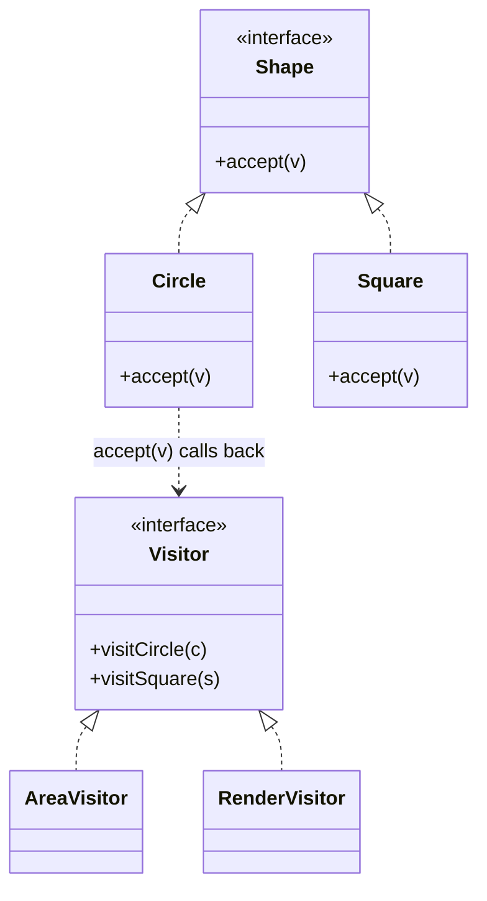

Add an operation to a structure you are not allowed to change. This is where the Expression Problem shows up: Visitor makes new *operations* cheap and new *types* expensive, while a sealed class with an exhaustive `when` makes exactly the opposite trade. Neither one replaces the other, and knowing which side you are on is the point of this session.

<!--more-->

## Structure

