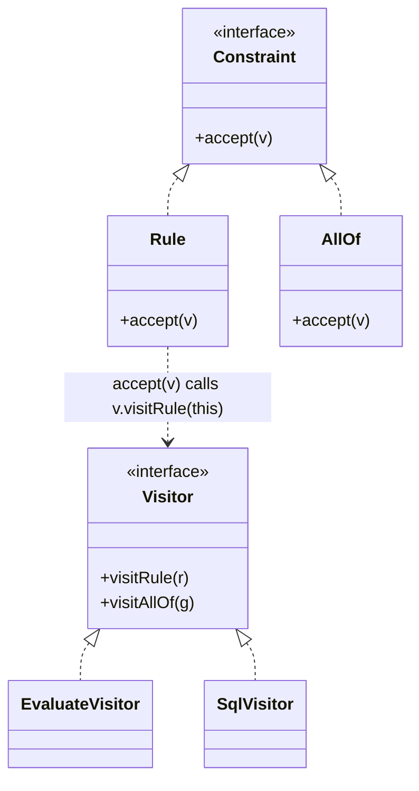

Add an operation to a structure you are not allowed to change. This is where the Expression Problem shows up -- and where a widely repeated claim about Kotlin turns out to be backwards.

<!--more-->

## The Problem

You have the `Constraint` tree from [Composite]({{ "/design_patterns/m4-composite/" | relative_url }}), and four operations over it: evaluate it, render it for the UI, compile it to SQL, estimate its solving cost.

In 1994 orthodoxy, an operation lives on the class it operates on. So the tree looks like this:

```kotlin
abstract class Constraint {
    abstract fun evaluate(s: Schedule): Boolean
    abstract fun render(): String
    abstract fun toSql(): String
    abstract fun estimateCost(): Int
}
```

Twelve node types, four operations, forty-eight method bodies spread across twelve files. A fifth operation means editing all twelve. And `toSql` -- a persistence concern -- now lives inside a domain object, next to `render`, a UI concern.

**The operations are not properties of the nodes. They have been forced to live there because that is where methods go.**

## Intent

> Represent an operation to be performed on the elements of an object structure. Visitor lets you define a new operation without changing the classes of the elements on which it operates.

## Structure



## Double dispatch, which is the whole mechanism

```kotlin
interface ConstraintVisitor<R> {
    fun visitRule(node: Constraint.Rule): R
    fun visitAllOf(node: Constraint.AllOf): R
}

interface Constraint {
    fun <R> accept(v: ConstraintVisitor<R>): R
}

class Rule(val spec: RuleSpec) : Constraint {
    override fun <R> accept(v: ConstraintVisitor<R>): R = v.visitRule(this)
}
```

Follow `node.accept(visitor)`:

1. **First dispatch** -- virtual call on `node`, so the runtime picks `Rule.accept`. The node's concrete type is now known.
2. **Second dispatch** -- inside it, `v.visitRule(this)` is a virtual call on `visitor`. The visitor's concrete type is now known too.

Two virtual calls to select behavior based on **two** runtime types. Kotlin and Java have single dispatch -- a call resolves on the receiver only -- so this is the standard way to fake multiple dispatch.

Which puts Visitor in a specific category: **it is a pattern that exists to simulate a missing language feature**, exactly as [Foundations]({{ "/design_patterns/m0-fundamentals/" | relative_url }}) described. That matters for what comes next.

## The Expression Problem, stated properly

Philip Wadler named it in 1998. Two axes of growth:

- add a new **variant** (a node type)
- add a new **operation**

The goal is to do either one without editing existing code, keeping static type safety. Here is where three approaches actually land:

| Approach | New variant | New operation |
|---|---|---|
| **Virtual methods on the nodes** | new class, nothing else changes ✅ | edit the base and every subclass ❌ |
| **Visitor** | edit the `Visitor` interface and every implementation ❌ | new visitor class ✅ |
| **`sealed` + exhaustive `when`** | every `when` must change -- **but the compiler names them** ⚠️ | new function ✅ |

**Visitor and `sealed` + `when` are on the same side of the trade-off.** Both make operations cheap and variants expensive. They are not opposites.

This is worth stating plainly because the opposite claim circulates widely, and I repeated it earlier in this series before working it through. What Visitor is the opposite of is **virtual methods on the nodes** -- the arrangement at the top of this page. Visitor exists to buy the pattern-matching trade-off in a language that has no pattern matching.

Kotlin has pattern matching. So:

```kotlin
fun Constraint.toSql(): String = when (this) {
    is Rule  -> spec.toSql()
    is AllOf -> children.joinToString(" AND ") { "(${it.toSql()})" }
    is AnyOf -> children.joinToString(" OR ")  { "(${it.toSql()})" }
}
```

One extension function. No `accept`, no visitor interface, no double dispatch -- and `toSql` lives in the persistence module where it belongs, touching nothing in the domain. Adding a variant is still the expensive direction, but now it is a **compile error at every site**, which is strictly better than a `Visitor` interface change you have to chase through implementations.

**In Kotlin, `sealed` + `when` is not an alternative to Visitor. It is Visitor, delivered by the language.**

## What Visitor still buys

Three things, and they are narrow but real.

**A hierarchy you cannot seal.** `sealed` requires all subtypes in the same module. If the hierarchy is open to third-party extension, `when` needs an `else ->` and loses exhaustiveness -- at which point Visitor's interface gives you a contract that `else` does not.

**A visitor is an object.** It can carry state across the whole traversal, be injected, be configured, be composed. A cost-estimating visitor that accumulates as it walks is more natural as an object than as a function threading an accumulator.

**The traversal can live in the structure.** With `accept` recursing into children, each visitor writes only what it does at each node. With `when`, every operation re-derives the recursion -- unless you factor it out once, which is exactly what [Iterator]({{ "/design_patterns/m4-iterator/" | relative_url }}) did on the previous page:

```kotlin
tree.walk().filterIsInstance<Rule>().sumOf { it.cost() }
```

That is the Kotlin answer to the third point, and it is why the second is usually the only one left standing.

## In the Wild

- **Kotlin compiler and KSP** -- `IrElementVisitor`, `KSVisitor`. Compiler IR is the natural habitat: many node types, many passes, hierarchies too large for `when`.
- **ASM's `ClassVisitor`, `MethodVisitor`** -- bytecode manipulation, and a good demonstration of the stateful-visitor case
- **`FileVisitor` / `Files.walkFileTree`** -- traversal owned by the structure, behavior supplied by the visitor
- **Jetpack Compose's `Modifier.foldIn` / `foldOut`** -- a fold rather than a visitor, which is the functional spelling of the same idea

Notice the pattern in that list: **Visitor survives in tooling over large, open, foreign hierarchies, and largely vanishes in application code.**

## Consequences

**You get:** operations added without touching the structure, related behavior gathered in one class, and state that persists across a traversal.

**You pay:** `accept` boilerplate on every node, a `Visitor` interface that every new node type breaks, and -- the one that surprises people -- **visitors need access to node internals**, so the nodes tend to expose more than they otherwise would. The encapsulation you preserved on the operations you paid for on the data.

**Don't use it when:**

- The hierarchy is sealed and yours. Use `when`; you already have Visitor.
- The variants change more often than the operations. You want virtual methods.
- There is one operation. A function.

## Exercise

Take a sealed hierarchy in your code and add a variant. Count the compile errors.

Now imagine the same change with a `Visitor` interface: the interface gains a method, every implementation breaks, and implementations in other modules break at *their* compile time, not yours.

**Both are the expensive direction. Only one of them tells you the whole cost at once** -- and that is the practical reason to prefer the language feature over the pattern.
