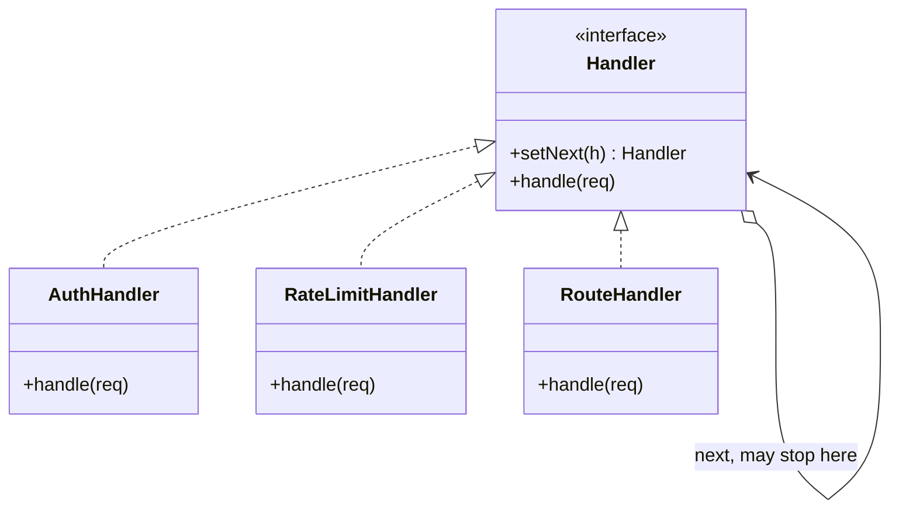

Structurally a chain, like Decorator, with one decisive difference: a handler may stop the request instead of passing it on. That single capability is what makes it right for auth, rate limiting, and routing.

<!--more-->

## The Problem

Every request into the scheduling API has to pass through the same gauntlet: authenticate, check the rate limit, look in the cache, log, then finally do the work.

```kotlin
suspend fun handle(req: Request): Response {
    val user = auth.verify(req) ?: return Response.unauthorized()
    if (!rateLimiter.allow(user)) return Response.tooManyRequests()
    cache.get(req)?.let { return it }
    val start = now()
    val res = route(req)
    log.record(req, res, now() - start)
    cache.put(req, res)
    return res
}
```

It works, and it is one function that knows about authentication, quotas, caching, timing and routing. Turning off caching in tests means editing it. Adding a tracing header means editing it. The five concerns are independent and the function is not.

Note the shape of the early returns: **each stage may finish the request instead of continuing.** That is the property Decorator does not have, and the reason this is a different pattern.

## Intent

> Avoid coupling the sender of a request to its receiver by giving more than one object a chance to handle the request. Chain the receiving objects and pass the request along the chain until an object handles it.

## Structure



## Two variants, and the modern one is better

**GoF's pure form:** the request travels until one handler claims it. Handlers before it do nothing; handlers after it never run. If nobody claims it, nothing happens.

**The interceptor form:** every handler runs, each can do work before *and* after the rest of the chain, and each decides whether the rest of the chain runs at all.

```kotlin
fun interface Interceptor {
    suspend fun intercept(req: Request, next: suspend (Request) -> Response): Response
}

val auth = Interceptor { req, next ->
    val user = verify(req) ?: return@Interceptor Response.unauthorized()   // stop
    next(req.withUser(user))                                               // continue
}

val timing = Interceptor { req, next ->
    val start = now()
    next(req).also { log.record(req, it, now() - start) }                  // wrap
}
```

The interceptor form subsumes both patterns of this pair: **calling `next` makes it a Decorator; not calling `next` makes it Chain of Responsibility.** Which one a given handler is, it decides per request. That is strictly more useful than either pure form, and it is why every modern framework ships this shape rather than GoF's.

Building the chain in Kotlin is a fold:

```kotlin
fun List<Interceptor>.pipeline(
    terminal: suspend (Request) -> Response,
): suspend (Request) -> Response =
    foldRight(terminal) { interceptor, next -> { req -> interceptor.intercept(req, next) } }
```

No `setNext`, no linked nodes, no mutable wiring. The list *is* the chain, and its order is visible at the call site.

## The traps

**Nobody handles it.** GoF flag this themselves: in the pure form a request can fall off the end and vanish. The fix is a terminal handler that always produces something -- in the fold above, `terminal` is not optional, which is the type system enforcing it.

**Order is the design, again.** Caching before authentication serves one user's data to another. Rate limiting after routing means the expensive work already happened. This is the same lesson as [Decorator]({{ "/design_patterns/m3-decorator/" | relative_url }}), with higher stakes: here the ordering mistakes are security bugs rather than log-line differences.

**Debugging.** When a request returns 401, which handler produced it? Stack traces through a folded chain of lambdas are unhelpful. Frameworks that take this seriously make the chain introspectable; a hand-rolled one should at least name its interceptors.

**Silent stops are worse than loud ones.** A handler that stops the chain and returns a default looks identical to one that handled the request properly. Make stopping explicit in the return type where you can.

## In the Wild

- **OkHttp's `Interceptor`** -- the canonical example, and it splits the list in two (`addInterceptor` vs `addNetworkInterceptor`) precisely because position in the chain matters
- **Ktor's pipelines and plugins** -- same shape, with named phases so ordering is declared rather than implied
- **Servlet `Filter`, Spring `HandlerInterceptor`** -- the server-side ancestors
- **Android touch dispatch** -- `dispatchTouchEvent` → `onInterceptTouchEvent` → children → `onTouchEvent`, where returning `true` stops the chain. Every Android developer has debugged this without knowing it was this pattern.
- **`try`/`catch` chains** -- the language's own version: the exception travels up until a handler claims it

## Consequences

**You get:** independent concerns, each testable alone, composed in an order you can read, with any of them able to short-circuit.

**You pay:** indirection you cannot follow in a debugger, an order dependency that nothing checks, and a request whose fate is decided somewhere you have to search for.

**Don't use it when:**

- Exactly one handler can ever apply. That is a `when`, and it is clearer.
- Every handler always runs. That is [Decorator]({{ "/design_patterns/m3-decorator/" | relative_url }}) -- say so, and the reader stops looking for the stop condition.
- The handlers are chosen by data rather than tried in order. That is a lookup table, not a chain.

## Exercise

Take the OkHttp client in your project and list its interceptors in order. For each, answer: **does it ever not call `chain.proceed()`?**

The ones that always proceed are decorators. The ones that can stop are this pattern. **Most codebases have both in the same list and have never distinguished them** -- and the distinction is what tells you which ones can break a request.
