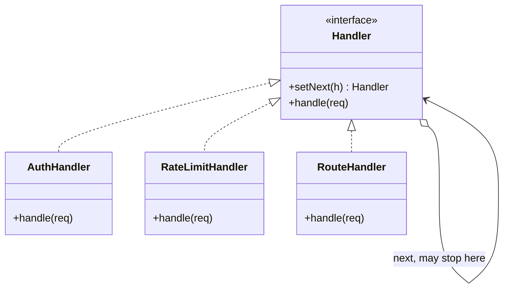

Structurally a chain, like Decorator, with one decisive difference: a handler may stop the request instead of passing it on. That single capability is what makes it right for auth, rate limiting, and routing. OkHttp's interceptor stack is this pattern in production, which makes it easy to study from real code.

<!--more-->

## Structure

