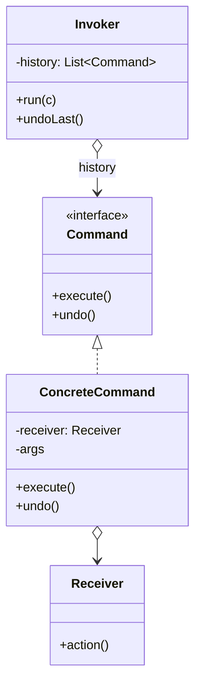

Turn a request into an object and queuing, logging, and undo come free. The comparison to hold is with Strategy: both wrap behavior in an object, but Strategy objectifies *how* something is done while Command objectifies *the request itself*.

<!--more-->

## Intent, which is unusually literal

> Encapsulate a request as an object, thereby letting you parameterize clients with different requests, queue or log requests, and support undoable operations.

Most GoF intents describe a structure. This one lists the four things you get:

1. parameterize clients with requests
2. **queue** them
3. **log** them
4. **undo** them

That list is also the applicability test. **If you need none of 2, 3 or 4, a function does everything Command does** -- and item 1 alone is just a callback.

## The Problem

A schedule editor needs undo. The obvious move fails immediately:

```kotlin
val action: () -> Unit = { schedule.assign(nurse, shift) }
undoStack.push(action)   // push what, exactly?
```

The lambda executes. That is all it does. It cannot say what it did, cannot reverse it, cannot be written to disk, and appears in a log as `Function0`. **A function is opaque by design, and every one of those four benefits requires transparency.**

## Structure



## Kotlin

```kotlin
sealed interface EditCommand {
    fun applyTo(s: Schedule): Schedule
    fun inverse(): EditCommand

    data class Assign(val nurse: NurseId, val shift: ShiftId) : EditCommand {
        override fun applyTo(s: Schedule) = s.withAssignment(nurse, shift)
        override fun inverse() = Unassign(nurse, shift)
    }

    data class Unassign(val nurse: NurseId, val shift: ShiftId) : EditCommand {
        override fun applyTo(s: Schedule) = s.withoutAssignment(nurse, shift)
        override fun inverse() = Assign(nurse, shift)
    }
}

class Editor(initial: Schedule) {
    private val done = ArrayDeque<EditCommand>()
    private val undone = ArrayDeque<EditCommand>()
    var schedule = initial; private set

    fun run(c: EditCommand) {
        schedule = c.applyTo(schedule)
        done.addLast(c); undone.clear()
    }

    fun undo() = done.removeLastOrNull()?.let { run2(it.inverse()); undone.addLast(it) }
}
```

Two things to notice.

**The command holds ids, not objects.** `NurseId`, not `Nurse`. A command that references live objects cannot be serialized, cannot outlive the session, and keeps whatever it points at alive. Commands are *messages*; they should be as inert as data.

**`applyTo` returns a new `Schedule`.** With an immutable receiver, "did it work" and "what did it produce" are the same question, and there is no partially-applied state to clean up if it throws.

## Two ways to undo, and you need both

**Inverse operations** -- each command knows its own reverse, as above. Cheap in memory and pleasant to read. Requires every operation to be genuinely reversible.

**Snapshots** -- store the state before executing and restore it. Always works, no matter how irreversible the operation. Costs memory proportional to state size times history depth.

Real editors use both: inverses for the common operations, snapshots for the ones that destroy information. "Clear all assignments" has no inverse that can reconstruct what was there, so it captures a snapshot instead.

That snapshot is [Memento]({{ "/design_patterns/m6-memento/" | relative_url }}), and pairing it with Command is the classic combination -- the next module opens on it.

## Function or data class

| | `() -> Unit` | `data class` |
|---|---|---|
| Execute | ✅ | ✅ |
| Name it in a log | `Function0` | `Assign(nurse=n-31, shift=s-902)` |
| Compare two | identity only | structural equality |
| Serialize, replay, send over a wire | ❌ | ✅ |
| Undo | ❌ | ✅ |

**The value of Command is not execution. It is that a request becomes a value.** That is the same gain [Interpreter]({{ "/design_patterns/m4-interpreter/" | relative_url }}) gets from making rules values, and it is why both patterns keep showing up in modern architectures: a value can be stored, replayed, tested, and reasoned about; a closure cannot.

## Command or Strategy?

| | Strategy | Command |
|---|---|---|
| Objectifies | **how** something is done | **what** was requested |
| Lifetime | one instance, injected, reused | many instances, often recorded |
| Typical count | a handful | thousands |
| Has an inverse? | meaningless | often the point |

## In the Wild

- **MVI / Redux actions** -- `data class` requests recorded in order. Time-travel debugging is possible only because they are values.
- **Event sourcing** -- the command log *is* the source of truth, and state is a fold over it
- **`WorkManager`, `JobScheduler`** -- commands serialized to disk so they survive process death. The ids-not-objects rule is enforced here by the framework.
- **Every editor's undo stack** -- the pattern's original habitat

## Consequences

**You get:** requests that can be stored, queued, retried, logged meaningfully, replayed, and reversed.

**You pay:** a type per operation, and an undo stack whose memory you now own.

**The trap nobody mentions: failure.** If `execute` throws halfway, is the command on the stack? Undoing a partially applied command corrupts state worse than the original failure. Immutable receivers dodge this -- apply produces a new value or throws, with nothing in between. With a mutable receiver you need each command to be atomic, and that is a real design obligation.

**Don't use it when:**

- You need none of queueing, logging or undo. A function is the same thing with less ceremony.
- The "commands" are one per call site and never recorded. That is a callback.
- You want to swap an algorithm. That is Strategy.

## Module M5 in one table

| | Sender knows receiver? | Can it stop? | What it objectifies |
|---|---|---|---|
| **Observer** | No | n/a | nothing -- a notification |
| **Mediator** | Only the hub | n/a | the coordination rules |
| **Chain of Responsibility** | No -- the next link | **Yes** | the handling step |
| **Command** | Holds a receiver id | n/a | **the request** |

All four break a direct call from A to B. They differ in what takes its place: nobody (Observer), a hub (Mediator), a queue of tries (CoR), or a value you can keep (Command).

## Exercise

Find a feature in your app that users would want to undo and currently cannot -- a delete, a bulk edit, a reorder.

Write the command type for it and its `inverse()`. **If you cannot write the inverse, you have found an operation that needs a snapshot** -- and knowing which of your operations are irreversible is worth the exercise even if you never build the undo stack.
