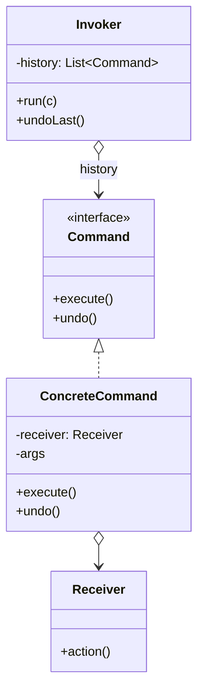

Turn a request into an object and queuing, logging, and undo come free. The comparison to hold is with Strategy: both wrap behavior in an object, but Strategy objectifies *how* something is done while Command objectifies *the request itself* -- which is why only Command gives you an undo stack.

<!--more-->

## Structure

