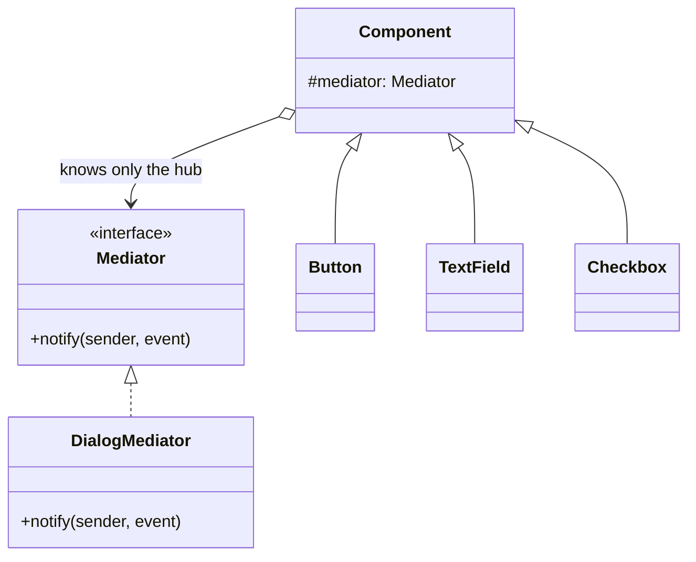

The other way to cut coupling. Where Observer's publisher knows nothing about its subscribers, a mediator knows all of them and holds the coordination logic. That is its value and its failure mode: every rule you cannot place anywhere else ends up in the hub, and the hub becomes a God Object.

<!--more-->

## Structure

