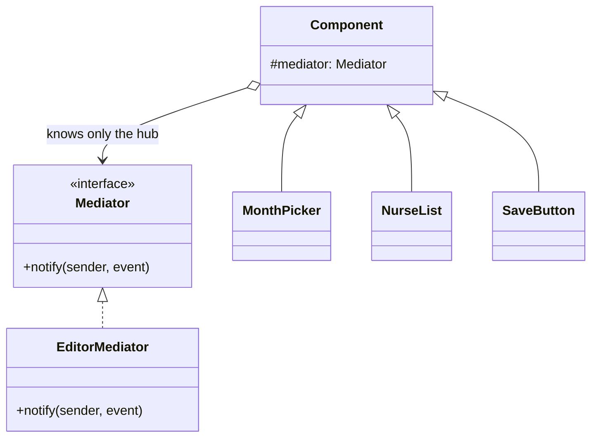

The other way to cut coupling. Where Observer's publisher knows nothing about its subscribers, a mediator knows all of them and holds the coordination logic. That is its value and its failure mode.

<!--more-->

## The Problem

A schedule editor: a month picker, a nurse list, a constraints panel, a conflict banner, a save button.

Change the month and the nurse list reloads, the constraints re-evaluate, the banner updates, and save is disabled until the reload finishes. Toggle a constraint and the banner updates and save re-enables. Pick a nurse and the constraints panel filters.

Wire that directly and every component holds references to the others:

```kotlin
class MonthPicker(
    private val nurseList: NurseList,
    private val constraints: ConstraintsPanel,
    private val banner: ConflictBanner,
    private val saveButton: SaveButton,
) { ... }
```

Five components, up to twenty directed relationships. None of them is reusable, none is testable alone, and adding a sixth means editing the five that must now know about it.

**No single component is complicated. The wiring between them is.**

## Intent

> Define an object that encapsulates how a set of objects interact. Mediator promotes loose coupling by keeping objects from referring to each other explicitly.

## Structure



N² relationships become N. Each component knows one thing -- the hub -- and the hub knows the rules.

## Observer or Mediator?

They are both answers to "A should not call B directly", so the distinction is worth stating precisely.

| | Observer | Mediator |
|---|---|---|
| Does the sender know the receivers? | **No** | The hub knows everyone |
| Where does coordination logic live? | **Nowhere** -- each subscriber decides for itself | In the hub |
| Direction | One-way broadcast | Two-way: components talk to the hub, the hub talks back |
| What it removes | The dependency | The dependency **and** the scattered rules |

That second row is the real difference. **Observer does not eliminate the knowledge of who reacts to what -- it distributes it to the subscribers.** Mediator gathers it into one place you can read.

Which you want depends on whether that knowledge is worth reading in one piece. "A schedule was saved, and five unrelated systems care" is Observer. "These five widgets have interlocking rules about when each is enabled" is Mediator -- because those rules *are* the feature, and scattering them across five subscribers means nobody can see the state machine.

Against [Facade]({{ "/design_patterns/m3-facade/" | relative_url }}), the difference is direction: a facade is one-way and the subsystem does not know it exists; a mediator is two-way and its components hold a reference to it.

## You already write these

In Android and KMP, the mediator has a name:

```kotlin
class ScheduleEditorViewModel(...) : ViewModel() {
    private val _state = MutableStateFlow(EditorState())
    val state: StateFlow<EditorState> = _state.asStateFlow()

    fun onMonthPicked(m: Month) {
        _state.update { it.copy(month = m, isSaveEnabled = false, isLoading = true) }
        viewModelScope.launch {
            val nurses = repo.nursesFor(m)
            val conflicts = rules.evaluate(nurses, _state.value.constraints)
            _state.update { it.copy(nurses = nurses, conflicts = conflicts,
                                    isLoading = false, isSaveEnabled = conflicts.isEmpty()) }
        }
    }
}
```

No composable calls another composable. Each emits an event to the hub and renders the state the hub produces. **That is Mediator, and the state object is how the hub talks back** -- which is also where the two patterns of this session meet: the mediator's outbound channel is an Observer.

Recognising that has a practical payoff. The most common complaint about ViewModels -- *"it grows until nobody understands it"* -- is not a ViewModel problem. **It is Mediator's documented failure mode, and it has a documented boundary.**

## The boundary

A mediator coordinates **between** components. It should not absorb the rules **inside** them.

In the code above, `rules.evaluate(...)` is a separate object. That line is the boundary. The moment conflict detection moves into the ViewModel, the hub stops being a mediator and starts being the application.

Two tests that work in practice:

- **Could this rule be unit-tested without the hub?** If yes, it belongs outside it.
- **Does this logic mention more than one component?** If no, it belongs in that component.

Everything the hub keeps should be about *relationships* -- when save is enabled, what a month change invalidates, which panel a selection filters. Those genuinely have nowhere else to live, and that is why the hub exists.

## In the Wild

- **`ViewModel`** -- the one you write daily
- **MVI reducers** -- a mediator as a pure function: `(State, Intent) -> State`, with the coordination rules readable in one place
- **`NavController`** -- screens do not know each other; they tell the navigator where to go
- **Air traffic control** -- GoF's own example, and still the clearest statement of why the hub exists: planes not talking to planes is the safety property

## Consequences

**You get:** N² relationships collapsed to N, components reusable and testable alone, and the interaction rules readable in one file.

**You pay:** a hub that is the most complex and least reusable object in the system, and one that is genuinely hard to test -- every component's rules run through it. Complexity did not vanish; it moved somewhere you can see it, which is usually the right trade and never a free one.

**Don't use it when:**

- There are three components and two relationships. Direct references are clearer.
- The components do not actually interact, they just react to the same thing. That is Observer.
- Your hub has stopped coordinating and started deciding domain questions. Extract the rules; keep the hub.

## Exercise

Open the largest ViewModel in your codebase and label every function: **coordination** (mentions two or more components or fields that constrain each other) or **domain rule** (could be tested with no ViewModel at all).

Then move the domain rules out. **Whatever remains is the mediator** -- and its size is an honest measure of how much interlocking your screen really has, rather than how much accumulated in the only class that had a constructor.
