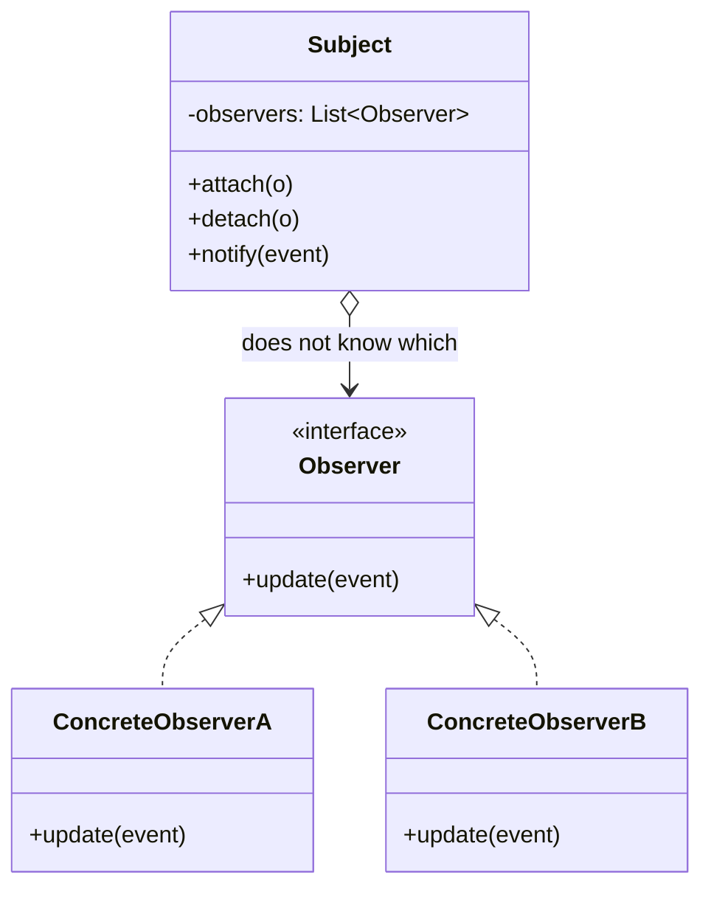

Opens the communication module. The publisher not knowing its subscribers is the whole point. The useful exercise here is not learning the pattern -- it is reading `Flow` as the answer to everything GoF left undefined.

<!--more-->

## The Problem

Saving a schedule has to cause five things: the UI refreshes, affected nurses get notified, an audit row is written, a cache is invalidated, an analytics event fires.

```kotlin
class ScheduleRepository(
    private val ui: ScheduleViewModel,
    private val notifier: Notifier,
    private val audit: AuditLog,
    private val cache: ScheduleCache,
    private val analytics: Analytics,
) {
    fun save(s: Schedule) {
        db.insert(s)
        ui.refresh(s); notifier.send(s); audit.record(s); cache.evict(s.ward); analytics.track(s)
    }
}
```

A repository that depends on the UI. Add a sixth reaction and the repository changes; remove one and it changes again. **The dependency points the wrong way** -- the thing that knows least about the application knows the most about it.

## Intent

> Define a one-to-many dependency between objects so that when one object changes state, all its dependents are notified and updated automatically.

## Structure



## What GoF left undefined

The pattern says "notify all dependents". It does not say **when**, **in what order**, **on which thread**, **what happens if one throws**, or **what a new subscriber sees**. Those gaps are where thirty years of Observer bugs live, and naming them is the point of this page.

### Push or pull

GoF's own listed choice. Push sends the data with the notification; pull sends only "something changed" and the observer calls back for state.

Push couples the subject to what observers need. Pull needs a round trip, and between the notification and the read the state may have changed again -- **a race the pattern creates and does not solve.**

### The lapsed listener

The one that actually costs money.

```kotlin
class ScheduleRepository {
    private val listeners = mutableListOf<(Schedule) -> Unit>()
    fun addListener(l: (Schedule) -> Unit) { listeners += l }
    fun removeListener(l: (Schedule) -> Unit) { listeners -= l }
}
```

An Activity subscribes. The device rotates. A new Activity subscribes. Nobody called `removeListener`, so the repository holds the old Activity -- and its whole view tree -- forever. This is the single most common memory leak in Android, and it is inherent to the pattern: **the subject holds strong references to objects whose lifetime it knows nothing about.**

The obvious fix makes it worse. Store `WeakReference`s and the lambda, which nothing else references, is collected almost immediately -- so notifications stop silently. You have traded a leak for a disappearing feature, which is harder to find.

### Reentrancy, ordering, failure

Unsubscribe from inside a callback and you are mutating the list being iterated. Two observers that depend on running in a particular order will work until someone reorders the subscriptions. One observer throws and the rest never run -- or do, depending on whoever wrote the loop.

None of these has an answer in the pattern. Each is a decision the implementer makes, usually without noticing they made it.

## Flow answers every one of them

This is the reframing worth carrying: **`Flow` did not replace Observer. It defined the parts Observer left open.**

| GoF leaves open | Flow's answer |
|---|---|
| Unsubscription | Structural concurrency -- collection ends when the `CoroutineScope` does. There is no `removeListener` to forget. |
| What a new subscriber sees | `StateFlow` always has a current value; `SharedFlow` has a configurable `replay`. |
| Producer faster than consumer | `collect` suspends. Or choose explicitly: `buffer`, `conflate`, `collectLatest`. |
| Which thread | Context preservation, with `flowOn` changing the upstream context only. |
| One observer throws | The exception propagates to the collector; `catch` handles it at a declared point. |
| Ordering | Sequential per collector, by construction. |

```kotlin
class ScheduleRepository {
    private val _saved = MutableSharedFlow<Schedule>()
    val saved: SharedFlow<Schedule> = _saved.asSharedFlow()

    suspend fun save(s: Schedule) {
        db.insert(s)
        _saved.emit(s)
    }
}
```

The repository now depends on nothing. Each reaction collects in its own scope, and each scope's end is the unsubscription.

### Choosing between the three

The practical decision, and the place people get bitten:

- **`StateFlow`** -- *state*. Always has a value, conflates, and drops emissions equal to the current one.
- **`SharedFlow`** -- *events*. No conflation, no equality check, configurable replay.
- **`Channel`** -- an event consumed exactly once, by one collector. No fan-out.

**Emitting the same value twice to a `StateFlow` delivers it once.** That is correct for state and wrong for events -- "show an error toast" sent twice in a row shows one toast. Every Android codebase learns this by shipping it.

## The Compose variant

Compose's snapshot system is Observer with the subscription inferred:

```kotlin
var query by remember { mutableStateOf("") }
Text(query)      // reading it here subscribes this composable
```

No `attach`. Reading a state object inside a composable registers that composable as a reader, and writing to it invalidates exactly the readers. **The pattern's hardest question -- who is subscribed -- is answered by the runtime observing what you read.** Worth knowing that this is Observer, because the failure modes rhyme: read state outside a composable and nothing recomposes, which is the lapsed listener in a new costume.

## In the Wild

- **`Flow` / `StateFlow` / `SharedFlow`** -- the modern form
- **`LiveData`** -- lifecycle-aware subscription, an explicit answer to the lapsed listener before coroutines had one
- **`Delegates.observable`** -- Observer at property granularity
- **`ContentObserver`, `BroadcastReceiver`** -- the pattern at the OS boundary, complete with manual unregistration and the leaks that follow

## Consequences

**You get:** a publisher decoupled from its subscribers, and reactions added and removed without touching the source.

**You pay:** control flow you cannot read. `emit` names no destination, so "what happens when a schedule is saved" is answerable only by searching for collectors. A stack trace in a collector does not include the emitter's stack.

**Don't use it when:**

- There is one reaction and there always will be. Call the function.
- The caller needs the result. Observer is fire-and-forget; a return value means you wanted a function.
- The order of reactions matters. You are describing a sequence -- that is a [Facade]({{ "/design_patterns/m3-facade/" | relative_url }}) or a pipeline, and encoding it as subscription order is a trap.

## Exercise

Find a `StateFlow` in your code carrying something that is an event rather than a state -- an error to show, a navigation command, a one-shot confirmation.

Emit the same value twice in a row and watch the second one vanish. **That silent drop is `StateFlow` behaving exactly as documented**, and finding one in your own code is the fastest way to internalize the state/event distinction.
