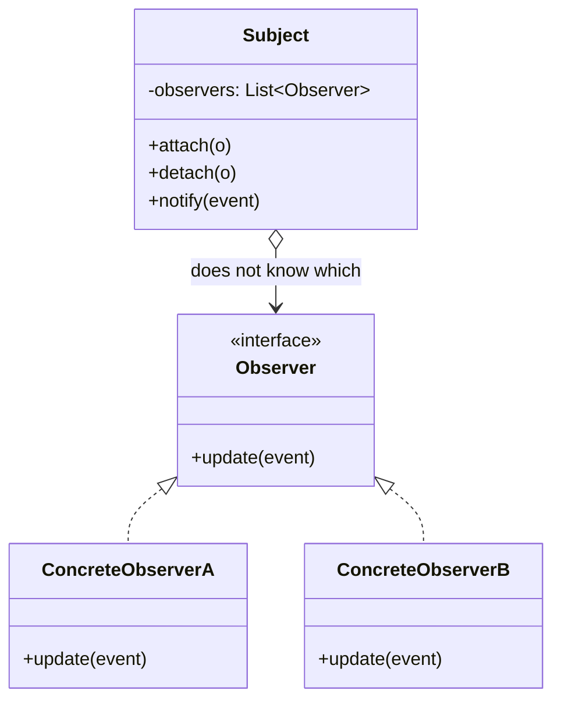

Opens the communication module. The publisher not knowing its subscribers is the whole point. Read it against `Flow` and `StateFlow` and ask which of the classic Observer problems -- leaked subscriptions, undefined delivery order, no backpressure -- the coroutine library actually solved, and which it just moved.

<!--more-->

## Structure

