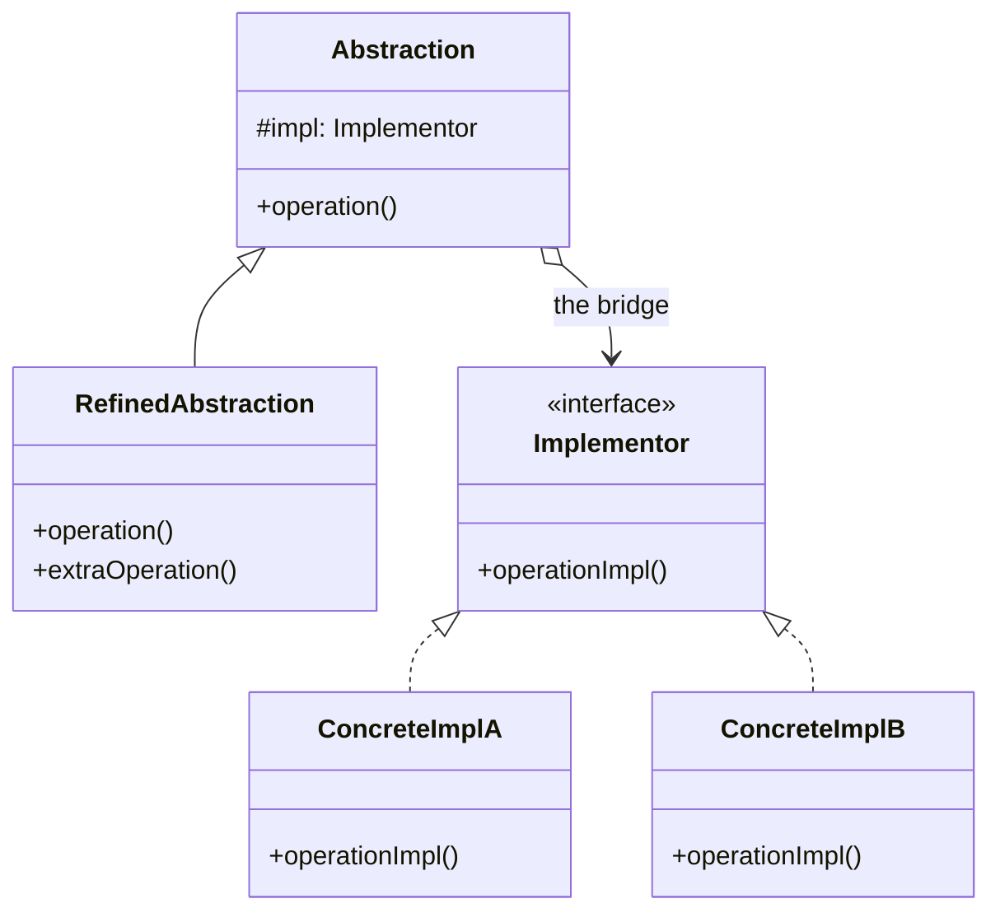

Split abstraction from implementation so both can grow independently. Its diagram matches Strategy's; the difference is that Strategy swaps an algorithm while Bridge separates two axes of variation. Against Adapter the difference is timing -- Bridge is prevention at design time, Adapter is repair after the fact.

<!--more-->

## Structure

