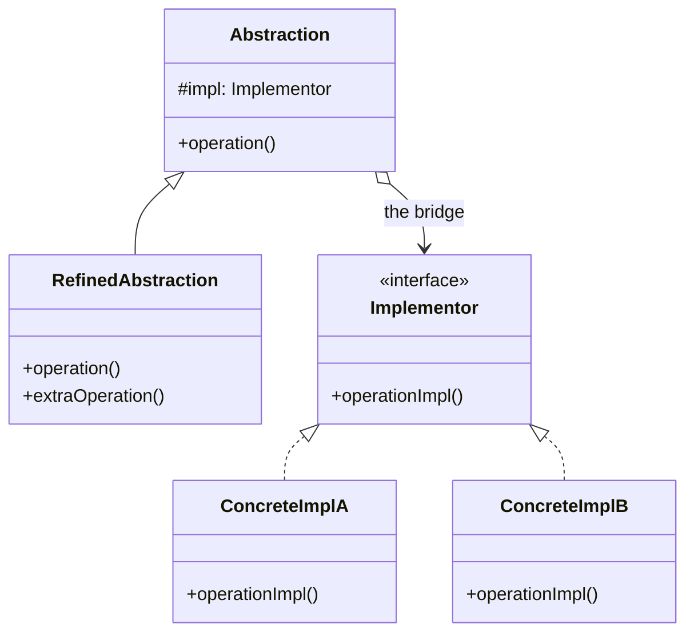

Split abstraction from implementation so both can grow independently. Its diagram matches Strategy's; the difference is that Strategy swaps an algorithm while Bridge separates two axes of variation.

<!--more-->

## The Problem

Notifications have a kind -- shift assigned, swap approved, conflict detected -- and a channel -- push, SMS, KakaoTalk, email. Model both with inheritance and you get the product:

```
ShiftAssignedPush   ShiftAssignedSms   ShiftAssignedKakao   ShiftAssignedEmail
SwapApprovedPush    SwapApprovedSms    SwapApprovedKakao    SwapApprovedEmail
ConflictPush        ConflictSms        ConflictKakao        ConflictEmail
```

Twelve classes. A fifth channel adds three; a fourth kind adds four. **The class count is the product of two things that have nothing to do with each other.**

## Intent

> Decouple an abstraction from its implementation so that the two can vary independently.

GoF's wording is unhelpfully abstract. Concretely: **you have two dimensions of variation, and inheritance can only express one.** Bridge picks one dimension for the class hierarchy and hands the other to composition.

## Structure



```kotlin
interface Channel {                                   // implementor axis
    suspend fun deliver(to: Recipient, title: String, body: String)
}

abstract class Notification(private val channel: Channel) {   // abstraction axis
    protected abstract fun title(): String
    protected abstract fun body(): String
    suspend fun sendTo(r: Recipient) = channel.deliver(r, title(), body())
}

class ShiftAssigned(channel: Channel, private val shift: Shift) : Notification(channel) { ... }
```

Three kinds plus four channels is seven types, and either side grows without touching the other.

## Strategy, Bridge, Adapter

The three patterns whose diagrams keep being confused, settled.

| | Strategy | Bridge | Adapter |
|---|---|---|---|
| How many hierarchies vary? | **One** -- the strategy | **Two** -- both sides | One, and it already exists |
| When is it decided? | Design time, one axis | Design time, two axes | **After the fact** |
| The context/abstraction is... | usually a single class | **itself a hierarchy** | the client, unchanged |

**The tell for Bridge is that the left-hand box is also a hierarchy.** In Strategy, `Context` is normally one class that takes a pluggable algorithm. In Bridge, `Abstraction` has subclasses of its own, and the whole point is that the two sets multiply without the class count multiplying.

Against Adapter the difference is timing, not shape: **Bridge is prevention designed in; Adapter is repair applied after two things that did not fit had to.**

## The KMP reading, and what it is missing

```kotlin
// commonMain
expect class PlatformNotifier() {
    fun send(title: String, body: String)
}

// androidMain / iosMain
actual class PlatformNotifier actual constructor() { ... }
```

Common code is the abstraction; each platform source set is an implementor. Two axes, growing independently, wired by the compiler. It is Bridge with the composition done at build time instead of construction time.

**And that is exactly what it gives up.** `expect`/`actual` is resolved per compilation, so there is no substituting an implementor at runtime -- which means no fake in a common test, and no choosing an implementation by configuration.

That is the practical reason much KMP advice prefers an ordinary interface plus a platform-provided factory over `expect class`:

```kotlin
// commonMain
interface Notifier { fun send(title: String, body: String) }
expect fun systemNotifier(): Notifier      // expect only at the edge
```

Now the abstraction depends on an interface it can be handed, `expect` is confined to one function at the boundary, and tests supply their own. **Keep the `expect` as small as possible and the Bridge stays a real bridge.**

## In the Wild

- **SLF4J** -- an API hierarchy and an implementation hierarchy (Logback, Log4j, java.util.logging) that have grown separately for twenty years. The cleanest Bridge in common use.
- **JDBC** -- `Connection`/`Statement` as abstraction, per-vendor `Driver` as implementor
- **KMP `expect`/`actual`** -- with the caveat above
- **Compose Multiplatform's rendering backends** -- one composable API over Skia, UIKit, DOM

## Consequences

**You get:** two dimensions that grow additively instead of multiplicatively, and implementations swappable without touching the abstraction.

**You pay:** one more indirection, and a decision you have to get right early. Bridge is the one pattern in this series that is genuinely hard to retrofit -- by the time you have twelve classes, splitting them means touching all twelve.

**Which is in tension with the gates from [Foundations]({{ "/design_patterns/m0-fundamentals/" | relative_url }}).** "Wait until the change arrives twice" is still right, and the signal to watch for is specific: **the moment a class name contains two nouns from two different vocabularies** -- `ShiftAssignedKakao` -- you have a product where you wanted a sum.

**Don't use it when:**

- Only one axis actually varies. That is Strategy, and pretending otherwise adds a hierarchy with one member.
- The second axis has two values and will never have three. Two classes are cheaper than a bridge.
- The two things already exist and do not fit. That is Adapter; Bridge is for designs you still control.

## Module M6, and the end of the catalogue

| | What it separates | Why it survives Kotlin |
|---|---|---|
| **Memento** | state from the object that owns it | mostly absorbed -- immutable snapshots are nearly free |
| **Flyweight** | shared state from per-use state | **intact** -- no feature shares large objects for you |
| **Bridge** | one axis of variation from another | **intact** -- `expect`/`actual` gives the shape, not the flexibility |

That completes all twenty-three. The remaining sessions are not new patterns: reading them in real libraries, and finding them -- and the over-applied ones -- in your own code.

## Exercise

Search your codebase for class names made of two concatenated concepts: `JsonHttpClient`, `SqlNurseRepository`, `PushShiftNotifier`.

For each, ask whether both halves are sets that grow. **Two growing sets is a Bridge you have not built yet.** One growing and one fixed is Strategy, and a name that just describes one thing is fine as it is.
