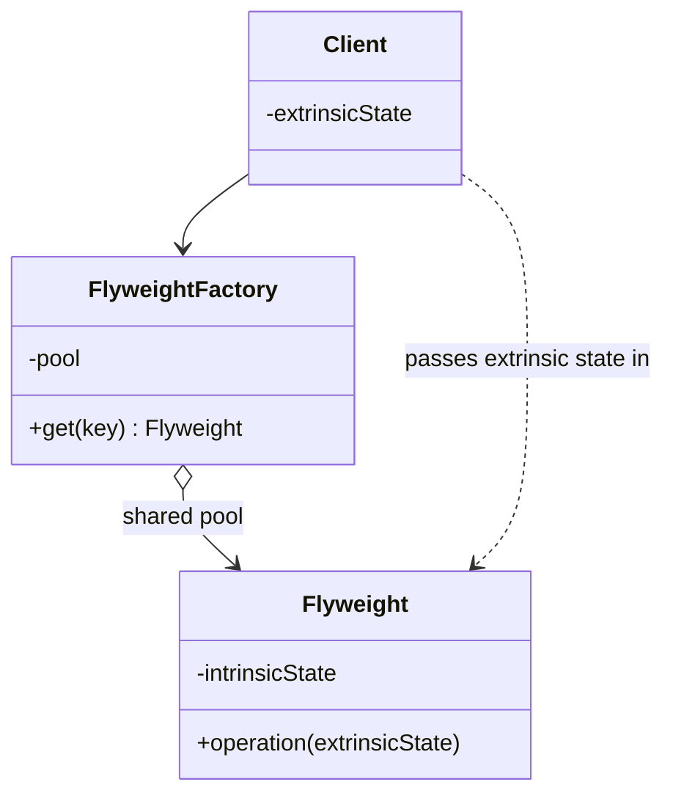

Share intrinsic state so a large number of objects costs less memory. One of the few patterns no Kotlin feature replaces, and one you will not need until you suddenly do.

<!--more-->

## The Problem

A schedule grid: 20 wards, 40 nurses, 31 days. Roughly 25,000 cells, each carrying how it should be drawn.

```kotlin
data class Cell(
    val nurse: NurseId,
    val date: LocalDate,
    val shiftType: String,     // "night"
    val label: String,         // "N"
    val background: Color,
    val textColor: Color,
    val border: BorderStyle,
    val icon: ImageBitmap?,
)
```

There are five shift types. So `label`, `background`, `textColor`, `border` and `icon` take five distinct combinations across 25,000 objects -- and the icons in particular are not small.

**The data is not per-cell. It is per-shift-type, stored per cell.**

## Intent

> Use sharing to support large numbers of fine-grained objects efficiently.

## Structure



## The only idea you need

GoF's terminology is the pattern:

- **Intrinsic state** -- belongs to the thing itself, identical across all uses, **immutable**, shareable. The colour and label of "night shift".
- **Extrinsic state** -- belongs to the context, different every time, not shareable. *Which* nurse, *which* date, *where* on screen.

```kotlin
class ShiftStyle private constructor(
    val label: String, val background: Color, val textColor: Color,
    val border: BorderStyle, val icon: ImageBitmap?,
) {
    companion object {
        private val pool = ConcurrentHashMap<String, ShiftStyle>()
        fun of(type: String): ShiftStyle = pool.getOrPut(type) { load(type) }
    }
}

data class Cell(val nurse: NurseId, val date: LocalDate, val style: ShiftStyle)
```

25,000 cells now hold 25,000 references to five objects.

**Doing the separation is most of the value, and it is worth doing even if you never build the pool.** Once intrinsic and extrinsic are apart, you can see that the intrinsic half is configuration, that it is immutable, and that it belongs somewhere other than in a loop.

## Kotlin often has a better answer

Flyweight reduces object count by sharing. Kotlin can sometimes reduce it to zero:

```kotlin
@JvmInline value class ShiftCode(val raw: Int)
```

A `value class` with a single primitive is not boxed on the heap at all in most positions -- no pool, no lookup, no cache eviction policy. `Color` in Compose is exactly this: a `Long` wearing a type, rather than a shared instance fetched from a table.

So the decision is about size:

- **Intrinsic state is small and primitive-shaped?** `value class`. No pattern needed.
- **Intrinsic state is large -- bitmaps, parsed fonts, decoded resources?** Flyweight. You cannot inline a bitmap.

The JVM already ships both answers: `Integer.valueOf` caches -128..127 (a flyweight pool), and `String` literals are interned (another one), while `int` is simply not an object.

## The traps

**The pool is a leak.** An unbounded `Map` that only ever grows is a memory leak wearing a cache's clothes. If keys come from user data rather than a fixed enumeration, you need an eviction policy -- and then you have a cache, with all of a cache's questions.

**Mutable intrinsic state is a disaster.** The whole premise is sharing. One caller mutating a shared flyweight changes it for every other user, and the bug appears somewhere unrelated. Intrinsic state must be immutable, and `val` on a `data class` with a `MutableList` inside does not count -- that is the [Prototype]({{ "/design_patterns/m2-prototype/" | relative_url }}) aliasing problem again.

**Optimizing without measuring.** This is a memory optimization. Introduced before profiling, it buys complexity and nothing else. The honest trigger is a heap dump showing thousands of near-identical objects, not an intuition that there might be.

## In the Wild

- **`String` interning and `Integer.valueOf`'s cache** -- the JVM's own flyweights
- **Android `Typeface` and font glyph caches** -- the case where the intrinsic state is genuinely large
- **Tile-based rendering** -- maps and games, the pattern's original habitat
- **`Char`/`Boolean` boxed caches** -- and `Color` as `value class`, which is the same problem solved the other way

## Consequences

**You get:** memory proportional to the number of *distinct* configurations rather than the number of objects.

**You pay:** indirection, a pool to manage, and extrinsic state that now has to be passed in at every call -- which makes the API of the shared object worse. A method that used to read fields now takes parameters.

**Don't use it when:**

- You have not measured. This is the one pattern where "it might help" is not a reason.
- The intrinsic state is a couple of primitives. `value class`.
- The shared state would have to change. Then it is not intrinsic, and the split is wrong.

## Exercise

Take a heap dump of a list-heavy screen and sort by instance count.

Look for a type with thousands of instances and few distinct field combinations. **That ratio -- instances divided by distinct values -- is exactly what this pattern recovers**, and if the ratio is near 1 there is nothing here to win.
