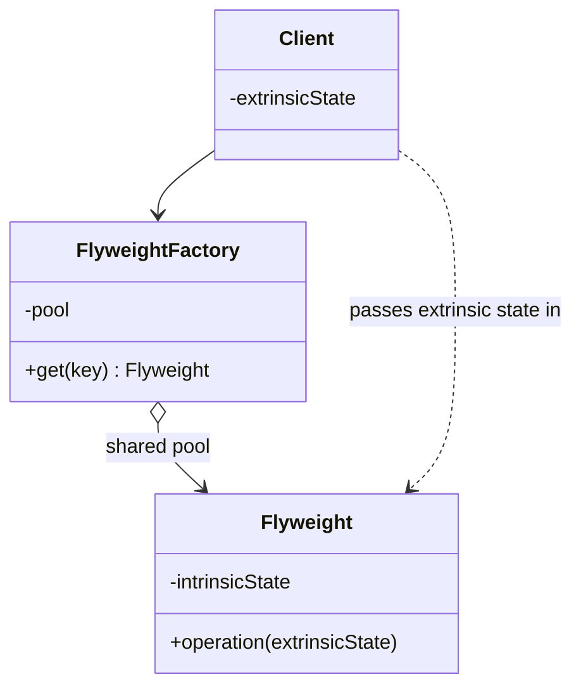

Share intrinsic state so a large number of objects costs less memory. One of the few patterns no Kotlin feature replaces, and one you will not need until you suddenly do -- icon and glyph caches, tile rendering, very large lists. The discipline it teaches is separating state that is intrinsic to the object from state that belongs to the context using it.

<!--more-->

## Structure

