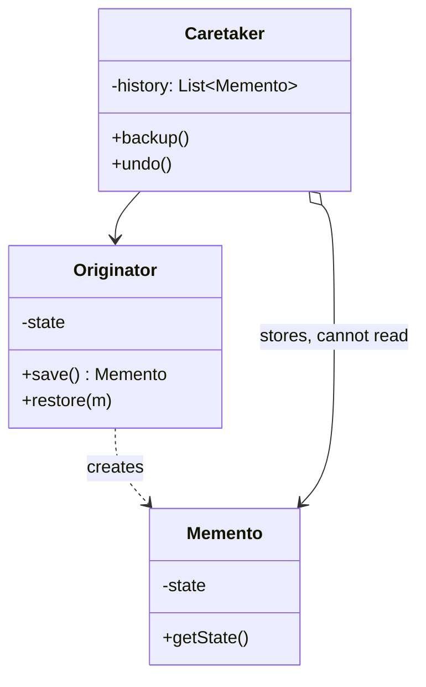

Save and restore state without exposing the object's internals. Immutable snapshots make the mechanics trivial in Kotlin, so the real work is deciding what belongs in a snapshot -- too much and undo is expensive, too little and it is wrong.

<!--more-->

## Structure

