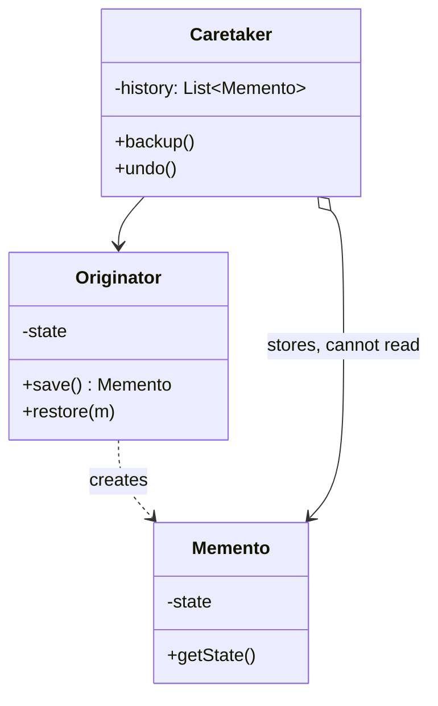

Save and restore state without exposing the object's internals. Immutable snapshots make the mechanics trivial in Kotlin, so the real work is deciding what belongs in a snapshot -- and what happens when the process dies.

<!--more-->

## The Problem

[Command]({{ "/design_patterns/m5-command/" | relative_url }}) left an operation with no inverse: "clear all assignments" destroys information that cannot be reconstructed. The fix is to save the state before the operation and restore it after.

The naive version does that by exposing everything:

```kotlin
class ScheduleEditor {
    var assignments: MutableMap<ShiftId, NurseId> = mutableMapOf()   // now public
    var constraints: MutableList<Constraint> = mutableListOf()       // now public
    var cursor: ShiftId? = null                                      // now public
}
```

The undo stack can now copy the state -- and so can everything else. **The pattern exists because the thing that needs your internals is the one thing that should not be allowed to use them.**

## Intent

> Without violating encapsulation, capture and externalize an object's internal state so that the object can be restored to this state later.

"Without violating encapsulation" is the whole pattern. GoF's structure has three roles for exactly this reason: an **Originator** that can read and write its own state, a **Memento** that holds it, and a **Caretaker** that stores mementos without being able to look inside them.

## Structure



## Kotlin

```kotlin
class ScheduleEditor {
    private var state = EditorState()

    class Snapshot internal constructor(internal val state: EditorState)

    fun save() = Snapshot(state)
    fun restore(s: Snapshot) { state = s.state }

    fun clearAll() { state = state.copy(assignments = emptyMap()) }
}

class History {
    private val stack = ArrayDeque<ScheduleEditor.Snapshot>()
    fun push(s: ScheduleEditor.Snapshot) { stack.addLast(s) }    // opaque to this class
    fun pop() = stack.removeLastOrNull()
}
```

Two mechanisms carry the pattern.

**`internal` on the constructor and the field.** `History` can hold a `Snapshot`, pass it around and hand it back, and cannot read it. Outside the module the type is opaque. Inside, the editor has full access -- which is exactly the asymmetry GoF achieved with C++ `friend` and Java nested classes.

**`state` is an immutable `data class`.** Saving is a reference copy; restoring is a reference assignment. The expensive half of this pattern in 1994 -- deep-copying mutable state -- costs nothing when the state is already a value.

## The three real decisions

**What goes in.** Everything, and memory grows. Only some of it, and restore is subtly wrong -- the assignments come back but the scroll position and selection do not, and users notice. The useful rule: **a snapshot must contain everything a user would be surprised to lose**, which is usually more than the domain data and less than the whole object.

**How deep.** N snapshots of a large state is N times the memory -- unless the state is a persistent structure with structural sharing, in which case consecutive snapshots share everything they have in common. This is the practical argument for `kotlinx.collections.immutable` in an editor: it turns undo depth from a memory budget into a non-issue.

**Whether it survives the process.** On Android this is the decision that actually bites. An in-memory snapshot does not survive process death, so the user comes back from a phone call to an empty editor. Surviving means serializing -- which means the snapshot must be serializable, which means no live object references in it. **That constraint should shape the snapshot type from the start**, because retrofitting it is a rewrite.

## Command plus Memento

The combination from the previous session, stated concretely: **inverse operations for the common case, snapshots for the irreversible ones.**

A third option worth knowing is the checkpoint: snapshot every N commands, and undo by restoring the nearest checkpoint and replaying forward. Memory proportional to N, restore time proportional to N. That is exactly how event sourcing handles snapshots, and how a database recovers from a log.

## In the Wild

- **`onSaveInstanceState` / `Bundle`** -- the pattern as an OS contract, with the serialization constraint enforced
- **`rememberSaveable`, `SavedStateHandle`** -- the modern form, same constraint
- **Database savepoints** -- `SAVEPOINT` / `ROLLBACK TO`, where the caretaker genuinely cannot inspect the saved state
- **Git commits** -- a caretaker (the reflog) holding opaque snapshots it does not interpret

## Consequences

**You get:** restore without opening the object up, and a history the caretaker can manage without understanding.

**You pay:** memory proportional to depth, and a second representation of your state that has to keep up as the state evolves. A field added to `EditorState` but forgotten in whatever narrows the snapshot is an undo bug nothing catches.

**Don't use it when:**

- The operation has a cheap inverse. Use it -- a snapshot is the fallback, not the default.
- The state is already immutable and already public. You have the snapshot; you just need somewhere to keep it.
- You only need the previous value of one field. That is a variable.

## Exercise

Open the editor-like screen in your app and list what a snapshot would have to contain for undo to feel correct -- including the parts that are not domain data: selection, scroll, expanded sections, in-progress text.

Then check each one against the serialization constraint. **The items that cannot be serialized are the ones that will be missing after process death** -- and finding them now is much cheaper than finding them in a bug report.
